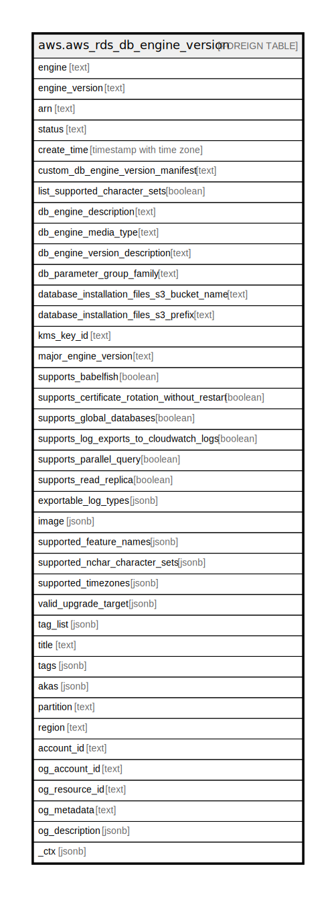

# aws.aws_rds_db_engine_version

## Description

AWS RDS DB Engine Version

## Columns

| Name | Type | Default | Nullable | Children | Parents | Comment |
| ---- | ---- | ------- | -------- | -------- | ------- | ------- |
| engine | text |  | true |  |  | The name of the database engine. |
| engine_version | text |  | true |  |  | The version number of the database engine. |
| arn | text |  | true |  |  | The ARN of the custom engine version. |
| status | text |  | true |  |  | The status of the DB engine version, either available or deprecated. |
| create_time | timestamp with time zone |  | true |  |  | The creation time of the DB engine version. |
| custom_db_engine_version_manifest | text |  | true |  |  | JSON string that lists the installation files and parameters that RDS Custom uses to create a custom engine version (CEV). |
| list_supported_character_sets | boolean |  | true |  |  | A value that indicates whether to list the supported character sets for each engine version. |
| db_engine_description | text |  | true |  |  | The description of the database engine. |
| db_engine_media_type | text |  | true |  |  | A value that indicates the source media provider of the AMI based on the usage operation. Applicable for RDS Custom for SQL Server. |
| db_engine_version_description | text |  | true |  |  | The description of the database engine version. |
| db_parameter_group_family | text |  | true |  |  | The name of the DB parameter group family for the database engine. |
| database_installation_files_s3_bucket_name | text |  | true |  |  | The name of the Amazon S3 bucket that contains your database installation files. |
| database_installation_files_s3_prefix | text |  | true |  |  | The Amazon S3 directory that contains the database installation files. If not specified, then no prefix is assumed. |
| kms_key_id | text |  | true |  |  | The Amazon Web Services KMS key identifier for an encrypted CEV. This parameter is required for RDS Custom, but optional for Amazon RDS. |
| major_engine_version | text |  | true |  |  | The major engine version of the CEV. |
| supports_babelfish | boolean |  | true |  |  | A value that indicates whether the engine version supports Babelfish for Aurora PostgreSQL. |
| supports_certificate_rotation_without_restart | boolean |  | true |  |  | A value that indicates whether the engine version supports rotating the server certificate without rebooting the DB instance. |
| supports_global_databases | boolean |  | true |  |  | A value that indicates whether you can use Aurora global databases with a specific DB engine version. |
| supports_log_exports_to_cloudwatch_logs | boolean |  | true |  |  | A value that indicates whether the engine version supports exporting the log types specified by ExportableLogTypes to CloudWatch Logs. |
| supports_parallel_query | boolean |  | true |  |  | A value that indicates whether you can use Aurora parallel query with a specific DB engine version. |
| supports_read_replica | boolean |  | true |  |  | Indicates whether the database engine version supports read replicas. |
| exportable_log_types | jsonb |  | true |  |  | The types of logs that the database engine has available for export to CloudWatch Logs. |
| image | jsonb |  | true |  |  | The EC2 image. |
| supported_feature_names | jsonb |  | true |  |  | A list of features supported by the DB engine. |
| supported_nchar_character_sets | jsonb |  | true |  |  | A list of the character sets supported by the Oracle DB engine for the NcharCharacterSetName parameter of the CreateDBInstance operation. |
| supported_timezones | jsonb |  | true |  |  | A list of the time zones supported by this engine for the Timezone parameter of the CreateDBInstance action. |
| valid_upgrade_target | jsonb |  | true |  |  | A list of engine versions that this database engine version can be upgraded to. |
| tag_list | jsonb |  | true |  |  | A list of tags. |
| title | text |  | true |  |  | Title of the resource. |
| tags | jsonb |  | true |  |  | A map of tags for the resource. |
| akas | jsonb |  | true |  |  | Array of globally unique identifier strings (also known as) for the resource. |
| partition | text |  | true |  |  | The AWS partition in which the resource is located (aws, aws-cn, or aws-us-gov). |
| region | text |  | true |  |  | The AWS Region in which the resource is located. |
| account_id | text |  | true |  |  | The AWS Account ID in which the resource is located. |
| og_account_id | text |  | true |  |  | The Platform Account ID in which the resource is located. |
| og_resource_id | text |  | true |  |  | The unique ID of the resource in opengovernance. |
| og_metadata | text |  | true |  |  | Platform Metadata of the AWS resource. |
| og_description | jsonb |  | true |  |  | The full model description of the resource |
| _ctx | jsonb |  | true |  |  | Steampipe context in JSON form, e.g. connection_name. |

## Relations

---

> Generated by [tbls](https://github.com/k1LoW/tbls)
