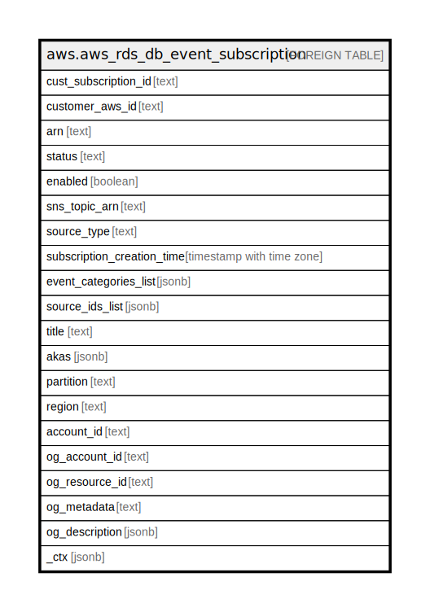

# aws.aws_rds_db_event_subscription

## Description

AWS RDS DB Event Subscription

## Columns

| Name | Type | Default | Nullable | Children | Parents | Comment |
| ---- | ---- | ------- | -------- | -------- | ------- | ------- |
| cust_subscription_id | text |  | true |  |  | The RDS event notification subscription Id. |
| customer_aws_id | text |  | true |  |  | The AWS customer account associated with the RDS event notification subscription. |
| arn | text |  | true |  |  | The Amazon Resource Name (ARN) for the event subscription. |
| status | text |  | true |  |  | The status of the RDS event notification subscription, it can be one of the following: creating | modifying | deleting | active | no-permission | topic-not-exist. |
| enabled | boolean |  | true |  |  | A Boolean value indicating if the subscription is enabled. True indicates the subscription is enabled. |
| sns_topic_arn | text |  | true |  |  | The topic ARN of the RDS event notification subscription. |
| source_type | text |  | true |  |  | The source type for the RDS event notification subscription. |
| subscription_creation_time | timestamp with time zone |  | true |  |  | The time the RDS event notification subscription was created. |
| event_categories_list | jsonb |  | true |  |  | A list of event categories for the RDS event notification subscription. |
| source_ids_list | jsonb |  | true |  |  | A list of source IDs for the RDS event notification subscription. |
| title | text |  | true |  |  | Title of the resource. |
| akas | jsonb |  | true |  |  | Array of globally unique identifier strings (also known as) for the resource. |
| partition | text |  | true |  |  | The AWS partition in which the resource is located (aws, aws-cn, or aws-us-gov). |
| region | text |  | true |  |  | The AWS Region in which the resource is located. |
| account_id | text |  | true |  |  | The AWS Account ID in which the resource is located. |
| og_account_id | text |  | true |  |  | The Platform Account ID in which the resource is located. |
| og_resource_id | text |  | true |  |  | The unique ID of the resource in opengovernance. |
| og_metadata | text |  | true |  |  | Platform Metadata of the AWS resource. |
| og_description | jsonb |  | true |  |  | The full model description of the resource |
| _ctx | jsonb |  | true |  |  | Steampipe context in JSON form, e.g. connection_name. |

## Relations

---

> Generated by [tbls](https://github.com/k1LoW/tbls)
