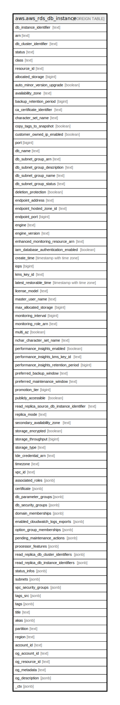

# aws.aws_rds_db_instance

## Description

AWS RDS DB Instance

## Columns

| Name | Type | Default | Nullable | Children | Parents | Comment |
| ---- | ---- | ------- | -------- | -------- | ------- | ------- |
| db_instance_identifier | text |  | true |  |  | The friendly name to identify the DB Instance. |
| arn | text |  | true |  |  | The Amazon Resource Name (ARN) for the DB Instance. |
| db_cluster_identifier | text |  | true |  |  | The friendly name to identify the DB cluster, that the DB instance is a member of. |
| status | text |  | true |  |  | Specifies the current state of this database. |
| class | text |  | true |  |  | Contains the name of the compute and memory capacity class of the DB instance. |
| resource_id | text |  | true |  |  | The AWS Region-unique, immutable identifier for the DB instance. |
| allocated_storage | bigint |  | true |  |  | Specifies the allocated storage size specified in gibibytes(GiB). |
| auto_minor_version_upgrade | boolean |  | true |  |  | Specifies whether minor version patches are applied automatically, or not. |
| availability_zone | text |  | true |  |  | Specifies the name of the Availability Zone the DB instance is located in. |
| backup_retention_period | bigint |  | true |  |  | Specifies the number of days for which automatic DB snapshots are retained. |
| ca_certificate_identifier | text |  | true |  |  | The identifier of the CA certificate for this DB instance. |
| character_set_name | text |  | true |  |  | Specifies the name of the character set that this instance is associated with. |
| copy_tags_to_snapshot | boolean |  | true |  |  | Specifies whether tags are copied from the DB instance to snapshots of the DB instance, or not. |
| customer_owned_ip_enabled | boolean |  | true |  |  | Specifies whether a customer-owned IP address (CoIP) is enabled for an RDS on Outposts DB instance, or not. |
| port | bigint |  | true |  |  | Specifies the port that the DB instance listens on. |
| db_name | text |  | true |  |  | Contains the name of the initial database of this instance that was provided at create time. |
| db_subnet_group_arn | text |  | true |  |  | The Amazon Resource Name (ARN) for the DB subnet group. |
| db_subnet_group_description | text |  | true |  |  | Provides the description of the DB subnet group. |
| db_subnet_group_name | text |  | true |  |  | The name of the DB subnet group. |
| db_subnet_group_status | text |  | true |  |  | Provides the status of the DB subnet group. |
| deletion_protection | boolean |  | true |  |  | Specifies whether the DB instance has deletion protection enabled, or not. |
| endpoint_address | text |  | true |  |  | Specifies the DNS address of the DB instance. |
| endpoint_hosted_zone_id | text |  | true |  |  | Specifies the ID that Amazon Route 53 assigns when you create a hosted zone. |
| endpoint_port | bigint |  | true |  |  | Specifies the port that the database engine is listening on. |
| engine | text |  | true |  |  | The name of the database engine to be used for this DB instance. |
| engine_version | text |  | true |  |  | Indicates the database engine version. |
| enhanced_monitoring_resource_arn | text |  | true |  |  | The ARN of the Amazon CloudWatch Logs log stream that receives the Enhanced Monitoring metrics data for the DB instance. |
| iam_database_authentication_enabled | boolean |  | true |  |  | Specifies whether the the mapping of AWS IAM accounts to database accounts is enabled, or not. |
| create_time | timestamp with time zone |  | true |  |  | Provides the date and time the DB instance was created. |
| iops | bigint |  | true |  |  | Specifies the Provisioned IOPS (I/O operations per second) value. |
| kms_key_id | text |  | true |  |  | The AWS KMS key identifier for the encrypted DB instance. |
| latest_restorable_time | timestamp with time zone |  | true |  |  | Specifies the latest time to which a database can be restored with point-in-time restore. |
| license_model | text |  | true |  |  | License model information for this DB instance. |
| master_user_name | text |  | true |  |  | Contains the master username for the DB instance. |
| max_allocated_storage | bigint |  | true |  |  | The upper limit to which Amazon RDS can automatically scale the storage of the DB instance. |
| monitoring_interval | bigint |  | true |  |  | The interval, in seconds, between points when Enhanced Monitoring metrics are collected for the DB instance. |
| monitoring_role_arn | text |  | true |  |  | The ARN for the IAM role that permits RDS to send Enhanced Monitoring metrics to Amazon CloudWatch Logs. |
| multi_az | boolean |  | true |  |  | Specifies if the DB instance is a Multi-AZ deployment. |
| nchar_character_set_name | text |  | true |  |  | The name of the NCHAR character set for the Oracle DB instance. |
| performance_insights_enabled | boolean |  | true |  |  | Specifies whether Performance Insights is enabled for the DB instance, or not. |
| performance_insights_kms_key_id | text |  | true |  |  | The AWS KMS key identifier for encryption of Performance Insights data. |
| performance_insights_retention_period | bigint |  | true |  |  | The amount of time, in days, to retain Performance Insights data. |
| preferred_backup_window | text |  | true |  |  | Specifies the daily time range during which automated backups are created. |
| preferred_maintenance_window | text |  | true |  |  | Specifies the weekly time range during which system maintenance can occur. |
| promotion_tier | bigint |  | true |  |  | Specifies the order in which an Aurora Replica is promoted to the primary instance after a failure of the existing primary instance. |
| publicly_accessible | boolean |  | true |  |  | Specifies the accessibility options for the DB instance. |
| read_replica_source_db_instance_identifier | text |  | true |  |  | Contains the identifier of the source DB instance if this DB instance is a read replica. |
| replica_mode | text |  | true |  |  | The mode of an Oracle read replica. |
| secondary_availability_zone | text |  | true |  |  | Specifies the name of the secondary Availability Zone for a DB instance with multi-AZ support. |
| storage_encrypted | boolean |  | true |  |  | Specifies whether the DB instance is encrypted, or not. |
| storage_throughput | bigint |  | true |  |  | Specifies the storage throughput for the DB instance. This setting applies only to the gp3 storage type. |
| storage_type | text |  | true |  |  | Specifies the storage type associated with DB instance. |
| tde_credential_arn | text |  | true |  |  |  The ARN from the key store with which the instance is associated for TDE encryption. |
| timezone | text |  | true |  |  | The time zone of the DB instance. |
| vpc_id | text |  | true |  |  | Provides the VpcId of the DB subnet group. |
| associated_roles | jsonb |  | true |  |  | A list of AWS IAM roles that are associated with the DB instance. |
| certificate | jsonb |  | true |  |  | The CA certificate associated with the DB instance. |
| db_parameter_groups | jsonb |  | true |  |  | A list of DB parameter groups applied to this DB instance. |
| db_security_groups | jsonb |  | true |  |  | A list of DB security group associated with the DB instance. |
| domain_memberships | jsonb |  | true |  |  | A list of Active Directory Domain membership records associated with the DB instance. |
| enabled_cloudwatch_logs_exports | jsonb |  | true |  |  | A list of log types that this DB instance is configured to export to CloudWatch Logs. |
| option_group_memberships | jsonb |  | true |  |  | A list of option group memberships for this DB instance |
| pending_maintenance_actions | jsonb |  | true |  |  | A list that provides details about the pending maintenance actions for the resource. |
| processor_features | jsonb |  | true |  |  | The number of CPU cores and the number of threads per core for the DB instance class of the DB instance. |
| read_replica_db_cluster_identifiers | jsonb |  | true |  |  | A list of identifiers of Aurora DB clusters to which the RDS DB instance is replicated as a read replica. |
| read_replica_db_instance_identifiers | jsonb |  | true |  |  | A list of identifiers of the read replicas associated with this DB instance. |
| status_infos | jsonb |  | true |  |  | The status of a read replica. |
| subnets | jsonb |  | true |  |  | A list of subnet elements. |
| vpc_security_groups | jsonb |  | true |  |  | A list of VPC security group elements that the DB instance belongs to. |
| tags_src | jsonb |  | true |  |  | A list of tags attached to the DB Instance. |
| tags | jsonb |  | true |  |  | A map of tags for the resource. |
| title | text |  | true |  |  | Title of the resource. |
| akas | jsonb |  | true |  |  | Array of globally unique identifier strings (also known as) for the resource. |
| partition | text |  | true |  |  | The AWS partition in which the resource is located (aws, aws-cn, or aws-us-gov). |
| region | text |  | true |  |  | The AWS Region in which the resource is located. |
| account_id | text |  | true |  |  | The AWS Account ID in which the resource is located. |
| og_account_id | text |  | true |  |  | The Platform Account ID in which the resource is located. |
| og_resource_id | text |  | true |  |  | The unique ID of the resource in opengovernance. |
| og_metadata | text |  | true |  |  | Platform Metadata of the AWS resource. |
| og_description | jsonb |  | true |  |  | The full model description of the resource |
| _ctx | jsonb |  | true |  |  | Steampipe context in JSON form, e.g. connection_name. |

## Relations

---

> Generated by [tbls](https://github.com/k1LoW/tbls)
