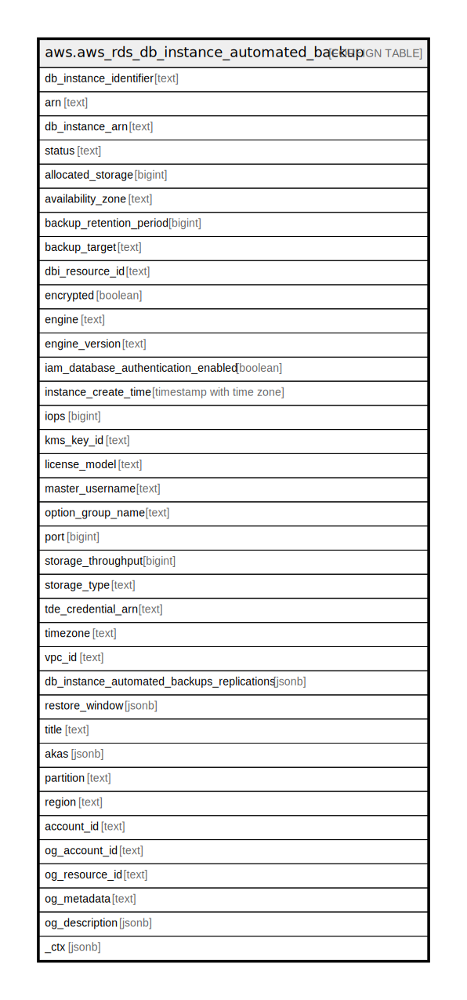

# aws.aws_rds_db_instance_automated_backup

## Description

AWS RDS DB Instance Automated Backup

## Columns

| Name | Type | Default | Nullable | Children | Parents | Comment |
| ---- | ---- | ------- | -------- | -------- | ------- | ------- |
| db_instance_identifier | text |  | true |  |  | The friendly name to identify the DB Instance. |
| arn | text |  | true |  |  | The Amazon Resource Name (ARN) for the replicated automated backups. |
| db_instance_arn | text |  | true |  |  | The Amazon Resource Name (ARN) for the automated backups. |
| status | text |  | true |  |  | Specifies the current state of this database. |
| allocated_storage | bigint |  | true |  |  | Specifies the allocated storage size in gibibytes (GiB). |
| availability_zone | text |  | true |  |  | The Availability Zone that the automated backup was created in. |
| backup_retention_period | bigint |  | true |  |  | The retention period for the automated backups. |
| backup_target | text |  | true |  |  | Specifies where automated backups are stored: Amazon Web Services Outposts or the Amazon Web Services Region. |
| dbi_resource_id | text |  | true |  |  | The identifier for the source DB instance, which can't be changed and which is unique to an Amazon Web Services Region. |
| encrypted | boolean |  | true |  |  | Specifies whether the automated backup is encrypted. |
| engine | text |  | true |  |  | The name of the database engine for this automated backup. |
| engine_version | text |  | true |  |  | The version of the database engine for the automated backup. |
| iam_database_authentication_enabled | boolean |  | true |  |  | True if mapping of Amazon Web Services Identity and Access Management (IAM) accounts to database accounts is enabled, and otherwise false. |
| instance_create_time | timestamp with time zone |  | true |  |  | True if mapping of Amazon Web Services Identity and Access Management (IAM) accounts to database accounts is enabled, and otherwise false. |
| iops | bigint |  | true |  |  | True if mapping of Amazon Web Services Identity and Access Management (IAM) accounts to database accounts is enabled, and otherwise false. |
| kms_key_id | text |  | true |  |  | The Amazon Web Services KMS key ID for an automated backup. The Amazon Web Services KMS key identifier is the key ARN, key ID, alias ARN, or alias name for the KMS key. |
| license_model | text |  | true |  |  | The Amazon Web Services KMS key ID for an automated backup. The Amazon Web Services KMS key identifier is the key ARN, key ID, alias ARN, or alias name for the KMS key. |
| master_username | text |  | true |  |  | The license model of an automated backup. |
| option_group_name | text |  | true |  |  | The option group the automated backup is associated with. If omitted, the default option group for the engine specified is used. |
| port | bigint |  | true |  |  | The port number that the automated backup used for connections. Default: Inherits from the source DB instance Valid Values: 1150-65535. |
| storage_throughput | bigint |  | true |  |  | Specifies the storage throughput for the automated backup. |
| storage_type | text |  | true |  |  | Specifies the storage type associated with the automated backup. |
| tde_credential_arn | text |  | true |  |  | The ARN from the key store with which the automated backup is associated for TDE encryption. |
| timezone | text |  | true |  |  | The time zone of the automated backup. |
| vpc_id | text |  | true |  |  | Provides the VPC ID associated with the DB instance. |
| db_instance_automated_backups_replications | jsonb |  | true |  |  | The list of replications to different Amazon Web Services Regions associated with the automated backup. |
| restore_window | jsonb |  | true |  |  | Earliest and latest time an instance can be restored to. |
| title | text |  | true |  |  | Title of the resource. |
| akas | jsonb |  | true |  |  | Array of globally unique identifier strings (also known as) for the resource. |
| partition | text |  | true |  |  | The AWS partition in which the resource is located (aws, aws-cn, or aws-us-gov). |
| region | text |  | true |  |  | The AWS Region in which the resource is located. |
| account_id | text |  | true |  |  | The AWS Account ID in which the resource is located. |
| og_account_id | text |  | true |  |  | The Platform Account ID in which the resource is located. |
| og_resource_id | text |  | true |  |  | The unique ID of the resource in opengovernance. |
| og_metadata | text |  | true |  |  | Platform Metadata of the AWS resource. |
| og_description | jsonb |  | true |  |  | The full model description of the resource |
| _ctx | jsonb |  | true |  |  | Steampipe context in JSON form, e.g. connection_name. |

## Relations

---

> Generated by [tbls](https://github.com/k1LoW/tbls)
