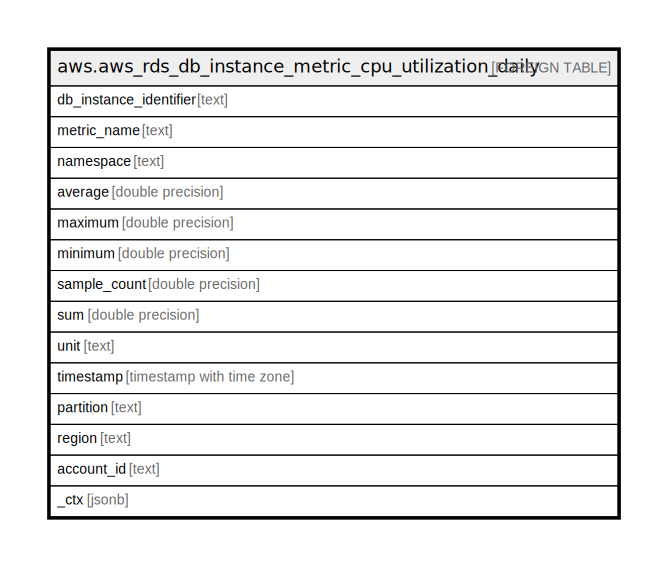

# aws.aws_rds_db_instance_metric_cpu_utilization_daily

## Description

AWS RDS DB Instance Cloudwatch Metrics - CPU Utilization (Daily)

## Columns

| Name | Type | Default | Nullable | Children | Parents | Comment |
| ---- | ---- | ------- | -------- | -------- | ------- | ------- |
| db_instance_identifier | text |  | true |  |  | The friendly name to identify the DB Instance. |
| metric_name | text |  | true |  |  | The name of the metric. |
| namespace | text |  | true |  |  | The metric namespace. |
| average | double precision |  | true |  |  | The average of the metric values that correspond to the data point. |
| maximum | double precision |  | true |  |  | The maximum metric value for the data point. |
| minimum | double precision |  | true |  |  | The minimum metric value for the data point. |
| sample_count | double precision |  | true |  |  | The number of metric values that contributed to the aggregate value of this data point. |
| sum | double precision |  | true |  |  | The sum of the metric values for the data point. |
| unit | text |  | true |  |  | The standard unit for the data point. |
| timestamp | timestamp with time zone |  | true |  |  | The time stamp used for the data point. |
| partition | text |  | true |  |  | The AWS partition in which the resource is located (aws, aws-cn, or aws-us-gov). |
| region | text |  | true |  |  | The AWS Region in which the resource is located. |
| account_id | text |  | true |  |  | The AWS Account ID in which the resource is located. |
| _ctx | jsonb |  | true |  |  | Steampipe context in JSON form, e.g. connection_name. |

## Relations

---

> Generated by [tbls](https://github.com/k1LoW/tbls)
