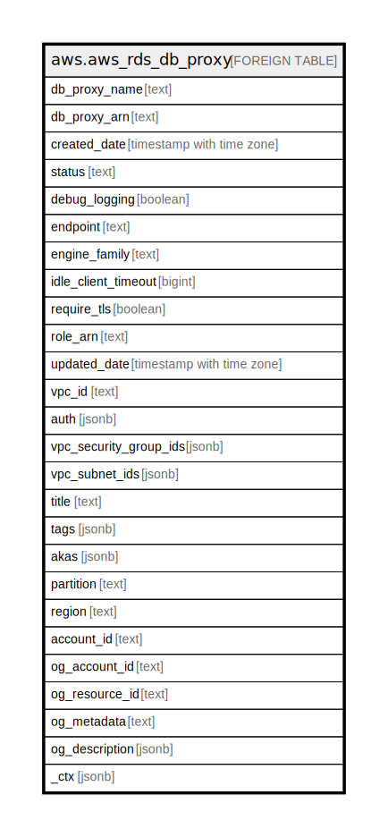

# aws.aws_rds_db_proxy

## Description

AWS RDS DB Proxy

## Columns

| Name | Type | Default | Nullable | Children | Parents | Comment |
| ---- | ---- | ------- | -------- | -------- | ------- | ------- |
| db_proxy_name | text |  | true |  |  | The identifier for the proxy. |
| db_proxy_arn | text |  | true |  |  | The Amazon Resource Name (ARN) for the proxy |
| created_date | timestamp with time zone |  | true |  |  | The date and time when the proxy was first created. |
| status | text |  | true |  |  | The current status of this proxy. |
| debug_logging | boolean |  | true |  |  | Whether the proxy includes detailed information about SQL statements in its logs. |
| endpoint | text |  | true |  |  | The endpoint that you can use to connect to the DB proxy. |
| engine_family | text |  | true |  |  | The kinds of databases that the proxy can connect to. |
| idle_client_timeout | bigint |  | true |  |  | The number of seconds a connection to the proxy can have no activity before the proxy drops the client connection. |
| require_tls | boolean |  | true |  |  | Indicates whether Transport Layer Security (TLS) encryption is required for connections to the proxy. |
| role_arn | text |  | true |  |  | The Amazon Resource Name (ARN) for the IAM role that the proxy uses to access Amazon Secrets Manager. |
| updated_date | timestamp with time zone |  | true |  |  | The date and time when the proxy was last updated. |
| vpc_id | text |  | true |  |  | Provides the VPC ID of the DB proxy. |
| auth | jsonb |  | true |  |  | One or more data structures specifying the authorization mechanism to connect to the associated RDS DB instance or Aurora DB cluster. |
| vpc_security_group_ids | jsonb |  | true |  |  | Provides a list of VPC security groups that the proxy belongs to. |
| vpc_subnet_ids | jsonb |  | true |  |  | The EC2 subnet IDs for the proxy. |
| title | text |  | true |  |  | Title of the resource. |
| tags | jsonb |  | true |  |  | A map of tags for the resource. |
| akas | jsonb |  | true |  |  | Array of globally unique identifier strings (also known as) for the resource. |
| partition | text |  | true |  |  | The AWS partition in which the resource is located (aws, aws-cn, or aws-us-gov). |
| region | text |  | true |  |  | The AWS Region in which the resource is located. |
| account_id | text |  | true |  |  | The AWS Account ID in which the resource is located. |
| og_account_id | text |  | true |  |  | The Platform Account ID in which the resource is located. |
| og_resource_id | text |  | true |  |  | The unique ID of the resource in opengovernance. |
| og_metadata | text |  | true |  |  | Platform Metadata of the AWS resource. |
| og_description | jsonb |  | true |  |  | The full model description of the resource |
| _ctx | jsonb |  | true |  |  | Steampipe context in JSON form, e.g. connection_name. |

## Relations

---

> Generated by [tbls](https://github.com/k1LoW/tbls)
