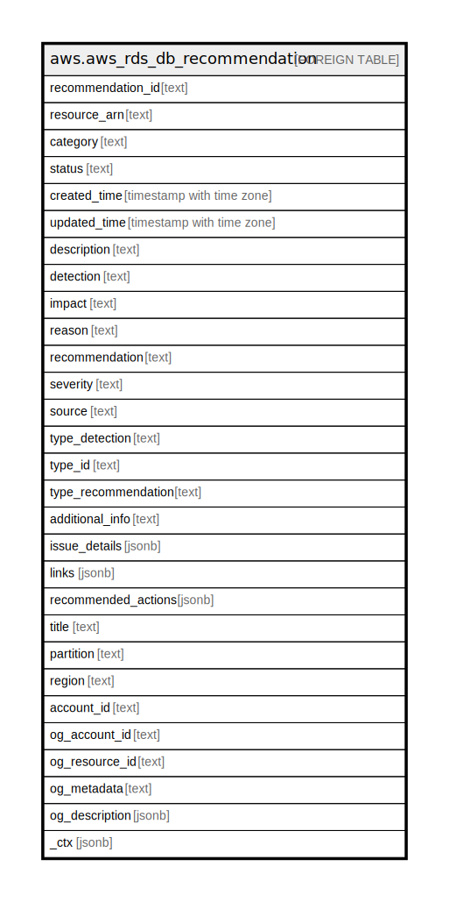

# aws.aws_rds_db_recommendation

## Description

AWS RDS DB Recommendation

## Columns

| Name | Type | Default | Nullable | Children | Parents | Comment |
| ---- | ---- | ------- | -------- | -------- | ------- | ------- |
| recommendation_id | text |  | true |  |  | The unique identifier for the recommendation. |
| resource_arn | text |  | true |  |  | The Amazon Resource Name (ARN) of the RDS resource associated with the recommendation. |
| category | text |  | true |  |  | The category of the recommendation. |
| status | text |  | true |  |  | The current status of the recommendation. |
| created_time | timestamp with time zone |  | true |  |  | The time when the recommendation was created. |
| updated_time | timestamp with time zone |  | true |  |  | The time when the recommendation was last updated. |
| description | text |  | true |  |  | A detailed description of the recommendation. |
| detection | text |  | true |  |  | A short description of the issue identified for this recommendation. |
| impact | text |  | true |  |  | A short description that explains the possible impact of an issue. |
| reason | text |  | true |  |  | The reason why this recommendation was created. |
| recommendation | text |  | true |  |  | A short description of the recommendation to resolve an issue. |
| severity | text |  | true |  |  | The severity level of the recommendation. |
| source | text |  | true |  |  | The AWS service that generated the recommendations. |
| type_detection | text |  | true |  |  | A short description of the recommendation type. |
| type_id | text |  | true |  |  | A value that indicates the type of recommendation. |
| type_recommendation | text |  | true |  |  | A short description that summarizes the recommendation to fix all the issues of the recommendation type. |
| additional_info | text |  | true |  |  | Additional information about the recommendation. |
| issue_details | jsonb |  | true |  |  | Details of the issue that caused the recommendation. |
| links | jsonb |  | true |  |  | A link to documentation that provides additional information about the recommendation. |
| recommended_actions | jsonb |  | true |  |  | A list of recommended actions. |
| title | text |  | true |  |  | Title of the resource. |
| partition | text |  | true |  |  | The AWS partition in which the resource is located (aws, aws-cn, or aws-us-gov). |
| region | text |  | true |  |  | The AWS Region in which the resource is located. |
| account_id | text |  | true |  |  | The AWS Account ID in which the resource is located. |
| og_account_id | text |  | true |  |  | The Platform Account ID in which the resource is located. |
| og_resource_id | text |  | true |  |  | The unique ID of the resource in opengovernance. |
| og_metadata | text |  | true |  |  | Platform Metadata of the AWS resource. |
| og_description | jsonb |  | true |  |  | The full model description of the resource |
| _ctx | jsonb |  | true |  |  | Steampipe context in JSON form, e.g. connection_name. |

## Relations

---

> Generated by [tbls](https://github.com/k1LoW/tbls)
