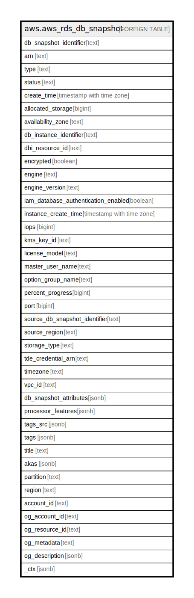

# aws.aws_rds_db_snapshot

## Description

AWS RDS DB Snapshot

## Columns

| Name | Type | Default | Nullable | Children | Parents | Comment |
| ---- | ---- | ------- | -------- | -------- | ------- | ------- |
| db_snapshot_identifier | text |  | true |  |  | The friendly name to identify the DB snapshot. |
| arn | text |  | true |  |  | The Amazon Resource Name (ARN) for the DB snapshot. |
| type | text |  | true |  |  | Provides the type of the DB snapshot. |
| status | text |  | true |  |  | Specifies the status of this DB snapshot. |
| create_time | timestamp with time zone |  | true |  |  | Specifies when the snapshot was taken. |
| allocated_storage | bigint |  | true |  |  | Specifies the allocated storage size in gibibytes(GiB). |
| availability_zone | text |  | true |  |  | Specifies the name of the Availability Zone the DB instance was located in, at the time of the DB snapshot. |
| db_instance_identifier | text |  | true |  |  | Specifies the DB instance identifier of the DB instance this DB snapshot was created from. |
| dbi_resource_id | text |  | true |  |  | The identifier for the source DB instance, which can't be changed and which is unique to an AWS Region. |
| encrypted | boolean |  | true |  |  | Specifies whether the DB snapshot is encrypted, or not. |
| engine | text |  | true |  |  | Specifies the name of the database engine. |
| engine_version | text |  | true |  |  | Specifies the version of the database engine. |
| iam_database_authentication_enabled | boolean |  | true |  |  | Specifies whether the mapping of AWS IAM accounts to database accounts is enabled, or not. |
| instance_create_time | timestamp with time zone |  | true |  |  | Specifies the time when the DB instance, from which the snapshot was taken, was created. |
| iops | bigint |  | true |  |  | Specifies the Provisioned IOPS (I/O operations per second) value of the DB instance at the time of the snapshot. |
| kms_key_id | text |  | true |  |  | Specifies the AWS KMS key identifier for the encrypted DB snapshot. |
| license_model | text |  | true |  |  | Specifies the License model information for the restored DB instance. |
| master_user_name | text |  | true |  |  | Provides the master username for the DB snapshot. |
| option_group_name | text |  | true |  |  | Provides the option group name for the DB snapshot. |
| percent_progress | bigint |  | true |  |  | The percentage of the estimated data that has been transferred. |
| port | bigint |  | true |  |  | Specifies the port that the database engine was listening on at the time of the snapshot. |
| source_db_snapshot_identifier | text |  | true |  |  | The DB snapshot ARN that the DB snapshot was copied from. |
| source_region | text |  | true |  |  | The AWS Region that the DB snapshot was created in or copied from. |
| storage_type | text |  | true |  |  | Specifies the storage type associated with DB snapshot. |
| tde_credential_arn | text |  | true |  |  | The ARN from the key store with which to associate the instance for TDE encryption. |
| timezone | text |  | true |  |  | The time zone of the DB snapshot. |
| vpc_id | text |  | true |  |  | Provides the VPC ID associated with the DB snapshot. |
| db_snapshot_attributes | jsonb |  | true |  |  | A list of DB snapshot attribute names and values for a manual DB snapshot. |
| processor_features | jsonb |  | true |  |  | The number of CPU cores and the number of threads per core for the DB instance class of the DB instance when the DB snapshot was created. |
| tags_src | jsonb |  | true |  |  | A list of tags attached to the DB snapshot. |
| tags | jsonb |  | true |  |  | A map of tags for the resource. |
| title | text |  | true |  |  | Title of the resource. |
| akas | jsonb |  | true |  |  | Array of globally unique identifier strings (also known as) for the resource. |
| partition | text |  | true |  |  | The AWS partition in which the resource is located (aws, aws-cn, or aws-us-gov). |
| region | text |  | true |  |  | The AWS Region in which the resource is located. |
| account_id | text |  | true |  |  | The AWS Account ID in which the resource is located. |
| og_account_id | text |  | true |  |  | The Platform Account ID in which the resource is located. |
| og_resource_id | text |  | true |  |  | The unique ID of the resource in opengovernance. |
| og_metadata | text |  | true |  |  | Platform Metadata of the AWS resource. |
| og_description | jsonb |  | true |  |  | The full model description of the resource |
| _ctx | jsonb |  | true |  |  | Steampipe context in JSON form, e.g. connection_name. |

## Relations

---

> Generated by [tbls](https://github.com/k1LoW/tbls)
