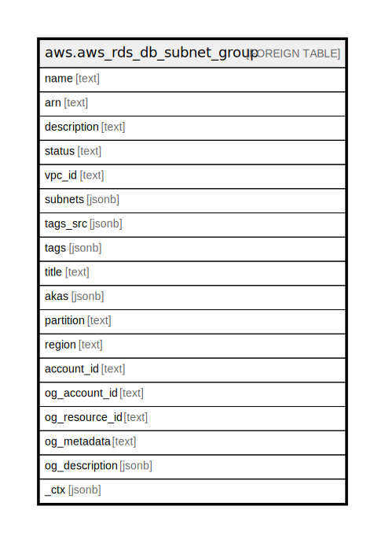

# aws.aws_rds_db_subnet_group

## Description

AWS RDS DB Subnet Group

## Columns

| Name | Type | Default | Nullable | Children | Parents | Comment |
| ---- | ---- | ------- | -------- | -------- | ------- | ------- |
| name | text |  | true |  |  | The friendly name to identify the DB subnet group. |
| arn | text |  | true |  |  | The Amazon Resource Name (ARN) for the DB subnet group. |
| description | text |  | true |  |  | Provides the description of the DB subnet group. |
| status | text |  | true |  |  | Provides the status of the DB subnet group. |
| vpc_id | text |  | true |  |  | Provides the VpcId of the DB subnet group. |
| subnets | jsonb |  | true |  |  | A list of Subnet elements. |
| tags_src | jsonb |  | true |  |  | A list of tags attached to the DB subnet group. |
| tags | jsonb |  | true |  |  | A map of tags for the resource. |
| title | text |  | true |  |  | Title of the resource. |
| akas | jsonb |  | true |  |  | Array of globally unique identifier strings (also known as) for the resource. |
| partition | text |  | true |  |  | The AWS partition in which the resource is located (aws, aws-cn, or aws-us-gov). |
| region | text |  | true |  |  | The AWS Region in which the resource is located. |
| account_id | text |  | true |  |  | The AWS Account ID in which the resource is located. |
| og_account_id | text |  | true |  |  | The Platform Account ID in which the resource is located. |
| og_resource_id | text |  | true |  |  | The unique ID of the resource in opengovernance. |
| og_metadata | text |  | true |  |  | Platform Metadata of the AWS resource. |
| og_description | jsonb |  | true |  |  | The full model description of the resource |
| _ctx | jsonb |  | true |  |  | Steampipe context in JSON form, e.g. connection_name. |

## Relations

---

> Generated by [tbls](https://github.com/k1LoW/tbls)
