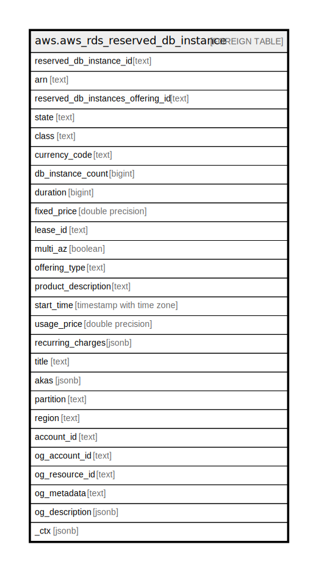

# aws.aws_rds_reserved_db_instance

## Description

AWS RDS Reserved DB Instance

## Columns

| Name | Type | Default | Nullable | Children | Parents | Comment |
| ---- | ---- | ------- | -------- | -------- | ------- | ------- |
| reserved_db_instance_id | text |  | true |  |  | The unique identifier for the reservation. |
| arn | text |  | true |  |  | The Amazon Resource Name (ARN) for the reserved DB Instance. |
| reserved_db_instances_offering_id | text |  | true |  |  | The offering identifier. |
| state | text |  | true |  |  | The state of the reserved DB instance. |
| class | text |  | true |  |  | The DB instance class for the reserved DB instance. |
| currency_code | text |  | true |  |  | The currency code for the reserved DB instance. |
| db_instance_count | bigint |  | true |  |  | The number of reserved DB instances. |
| duration | bigint |  | true |  |  | The duration of the reservation in seconds. |
| fixed_price | double precision |  | true |  |  | The fixed price charged for this reserved DB instance. |
| lease_id | text |  | true |  |  | The unique identifier for the lease associated with the reserved DB instance. |
| multi_az | boolean |  | true |  |  | Indicates if the reservation applies to Multi-AZ deployments. |
| offering_type | text |  | true |  |  | The offering type of this reserved DB instance. |
| product_description | text |  | true |  |  | The description of the reserved DB instance. |
| start_time | timestamp with time zone |  | true |  |  | The time the reservation started. |
| usage_price | double precision |  | true |  |  | The hourly price charged for this reserved DB instance. |
| recurring_charges | jsonb |  | true |  |  | The recurring price charged to run this reserved DB instance. |
| title | text |  | true |  |  | Title of the resource. |
| akas | jsonb |  | true |  |  | Array of globally unique identifier strings (also known as) for the resource. |
| partition | text |  | true |  |  | The AWS partition in which the resource is located (aws, aws-cn, or aws-us-gov). |
| region | text |  | true |  |  | The AWS Region in which the resource is located. |
| account_id | text |  | true |  |  | The AWS Account ID in which the resource is located. |
| og_account_id | text |  | true |  |  | The Platform Account ID in which the resource is located. |
| og_resource_id | text |  | true |  |  | The unique ID of the resource in opengovernance. |
| og_metadata | text |  | true |  |  | Platform Metadata of the AWS resource. |
| og_description | jsonb |  | true |  |  | The full model description of the resource |
| _ctx | jsonb |  | true |  |  | Steampipe context in JSON form, e.g. connection_name. |

## Relations

---

> Generated by [tbls](https://github.com/k1LoW/tbls)
