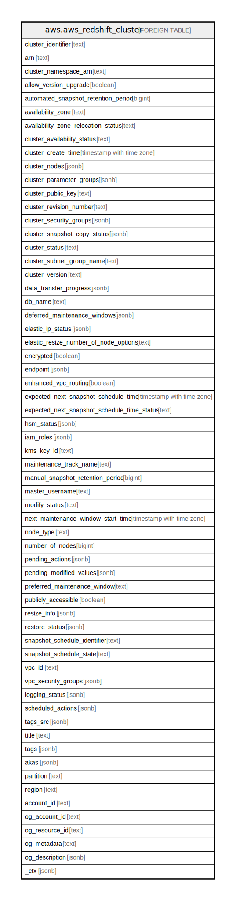

# aws.aws_redshift_cluster

## Description

AWS Redshift Cluster

## Columns

| Name | Type | Default | Nullable | Children | Parents | Comment |
| ---- | ---- | ------- | -------- | -------- | ------- | ------- |
| cluster_identifier | text |  | true |  |  | The unique identifier of the cluster. |
| arn | text |  | true |  |  | The Amazon Resource Name (ARN) specifying the cluster. |
| cluster_namespace_arn | text |  | true |  |  | The namespace Amazon Resource Name (ARN) of the cluster. |
| allow_version_upgrade | boolean |  | true |  |  | A boolean value that, if true, indicates that major version upgrades will be applied automatically to the cluster during the maintenance window. |
| automated_snapshot_retention_period | bigint |  | true |  |  | The number of days that automatic cluster snapshots are retained. |
| availability_zone | text |  | true |  |  | The name of the Availability Zone in which the cluster is located. |
| availability_zone_relocation_status | text |  | true |  |  | Describes the status of the Availability Zone relocation operation. |
| cluster_availability_status | text |  | true |  |  | The availability status of the cluster for queries. |
| cluster_create_time | timestamp with time zone |  | true |  |  | The date and time that the cluster was created. |
| cluster_nodes | jsonb |  | true |  |  | The nodes in the cluster. |
| cluster_parameter_groups | jsonb |  | true |  |  | The list of cluster parameter groups that are associated with this cluster. Each parameter group in the list is returned with its status. |
| cluster_public_key | text |  | true |  |  | The public key for the cluster. |
| cluster_revision_number | text |  | true |  |  | The specific revision number of the database in the cluster. |
| cluster_security_groups | jsonb |  | true |  |  | A list of cluster security group that are associated with the cluster. Each security group is represented by an element that contains ClusterSecurityGroup.Name and ClusterSecurityGroup.Status subelements. Cluster security groups are used when the cluster is not created in an Amazon Virtual Private Cloud (VPC). Clusters that are created in a VPC use VPC security groups, which are listed by the VpcSecurityGroups parameter. |
| cluster_snapshot_copy_status | jsonb |  | true |  |  | A value that returns the destination region and retention period that are configured for cross-region snapshot copy. |
| cluster_status | text |  | true |  |  | The current state of the cluster. |
| cluster_subnet_group_name | text |  | true |  |  | The name of the subnet group that is associated with the cluster. This parameter is valid only when the cluster is in a VPC. |
| cluster_version | text |  | true |  |  | The version ID of the Amazon Redshift engine that is running on the cluster. |
| data_transfer_progress | jsonb |  | true |  |  | Describes the status of a cluster while it is in the process of resizing with an incremental resize. |
| db_name | text |  | true |  |  | The name of the initial database that was created when the cluster was created. This same name is returned for the life of the cluster. If an initial database was not specified, a database named devdev was created by default. |
| deferred_maintenance_windows | jsonb |  | true |  |  | Describes a group of DeferredMaintenanceWindow objects. |
| elastic_ip_status | jsonb |  | true |  |  | The status of the elastic IP (EIP) address. |
| elastic_resize_number_of_node_options | text |  | true |  |  | The number of nodes that you can resize the cluster to with the elastic resize method. |
| encrypted | boolean |  | true |  |  | A boolean value that, if true, indicates that data in the cluster is encrypted at rest. |
| endpoint | jsonb |  | true |  |  | The connection endpoint. |
| enhanced_vpc_routing | boolean |  | true |  |  | An option that specifies whether to create the cluster with enhanced VPC routing enabled. To create a cluster that uses enhanced VPC routing, the cluster must be in a VPC. If this option is true, enhanced VPC routing is enabled. |
| expected_next_snapshot_schedule_time | timestamp with time zone |  | true |  |  | The date and time when the next snapshot is expected to be taken for clusters with a valid snapshot schedule and backups enabled. |
| expected_next_snapshot_schedule_time_status | text |  | true |  |  | The status of next expected snapshot for clusters having a valid snapshot schedule and backups enabled. |
| hsm_status | jsonb |  | true |  |  | A value that reports whether the Amazon Redshift cluster has finished applying any hardware security module (HSM) settings changes specified in a modify cluster command. |
| iam_roles | jsonb |  | true |  |  | A list of AWS Identity and Access Management (IAM) roles that can be used by the cluster to access other AWS services. |
| kms_key_id | text |  | true |  |  | The AWS Key Management Service (AWS KMS) key ID of the encryption key used to encrypt data in the cluster. |
| maintenance_track_name | text |  | true |  |  | The name of the maintenance track for the cluster. |
| manual_snapshot_retention_period | bigint |  | true |  |  | The default number of days to retain a manual snapshot. If the value is -1, the snapshot is retained indefinitely. This setting doesn't change the retention period of existing snapshots. The value must be either -1 or an integer between 1 and 3,653. |
| master_username | text |  | true |  |  | The master user name for the cluster. This name is used to connect to the database that is specified in the DBName parameter. |
| modify_status | text |  | true |  |  | The status of a modify operation, if any, initiated for the cluster. |
| next_maintenance_window_start_time | timestamp with time zone |  | true |  |  | The date and time in UTC when system maintenance can begin. |
| node_type | text |  | true |  |  | The node type for the nodes in the cluster. |
| number_of_nodes | bigint |  | true |  |  | The number of compute nodes in the cluster. |
| pending_actions | jsonb |  | true |  |  | Cluster operations that are waiting to be started. |
| pending_modified_values | jsonb |  | true |  |  | A value that, if present, indicates that changes to the cluster are pending. Specific pending changes are identified by subelements. |
| preferred_maintenance_window | text |  | true |  |  | The weekly time range, in Universal Coordinated Time (UTC), during which system maintenance can occur. |
| publicly_accessible | boolean |  | true |  |  | A boolean value that, if true, indicates that the cluster can be accessed from a public network. |
| resize_info | jsonb |  | true |  |  | Describes a resize operation. |
| restore_status | jsonb |  | true |  |  | A value that describes the status of a cluster restore action. This parameter returns null if the cluster was not created by restoring a snapshot. |
| snapshot_schedule_identifier | text |  | true |  |  | A unique identifier for the cluster snapshot schedule. |
| snapshot_schedule_state | text |  | true |  |  | The current state of the cluster snapshot schedule. |
| vpc_id | text |  | true |  |  | The identifier of the VPC the cluster is in, if the cluster is in a VPC. |
| vpc_security_groups | jsonb |  | true |  |  | A list of Amazon Virtual Private Cloud (Amazon VPC) security groups that are associated with the cluster. This parameter is returned only if the cluster is in a VPC. |
| logging_status | jsonb |  | true |  |  | Describes the status of logging for a cluster. |
| scheduled_actions | jsonb |  | true |  |  | A list of scheduled actions for specified cluster. |
| tags_src | jsonb |  | true |  |  | The list of tags for the cluster. |
| title | text |  | true |  |  | Title of the resource. |
| tags | jsonb |  | true |  |  | A map of tags for the resource. |
| akas | jsonb |  | true |  |  | Array of globally unique identifier strings (also known as) for the resource. |
| partition | text |  | true |  |  | The AWS partition in which the resource is located (aws, aws-cn, or aws-us-gov). |
| region | text |  | true |  |  | The AWS Region in which the resource is located. |
| account_id | text |  | true |  |  | The AWS Account ID in which the resource is located. |
| og_account_id | text |  | true |  |  | The Platform Account ID in which the resource is located. |
| og_resource_id | text |  | true |  |  | The unique ID of the resource in opengovernance. |
| og_metadata | text |  | true |  |  | Platform Metadata of the AWS resource. |
| og_description | jsonb |  | true |  |  | The full model description of the resource |
| _ctx | jsonb |  | true |  |  | Steampipe context in JSON form, e.g. connection_name. |

## Relations

---

> Generated by [tbls](https://github.com/k1LoW/tbls)
