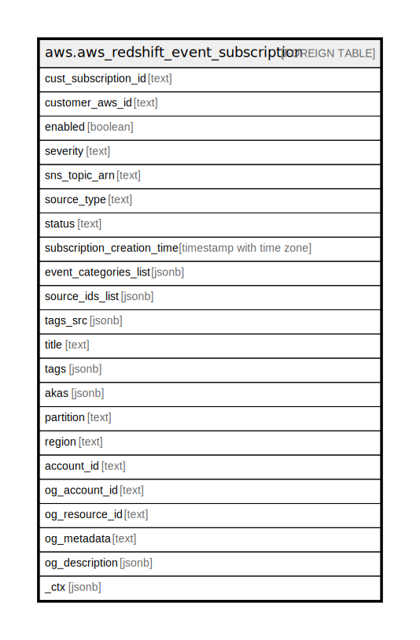

# aws.aws_redshift_event_subscription

## Description

AWS Redshift Event Subscription

## Columns

| Name | Type | Default | Nullable | Children | Parents | Comment |
| ---- | ---- | ------- | -------- | -------- | ------- | ------- |
| cust_subscription_id | text |  | true |  |  | The name of the Amazon Redshift event notification subscription. |
| customer_aws_id | text |  | true |  |  | The AWS customer account associated with the Amazon Redshift event notification subscription. |
| enabled | boolean |  | true |  |  | A boolean value indicating whether the subscription is enabled or disabled |
| severity | text |  | true |  |  | The event severity specified in the Amazon Redshift event notification subscription. |
| sns_topic_arn | text |  | true |  |  | The Amazon Resource Name (ARN) of the Amazon SNS topic used by the event notification subscription. |
| source_type | text |  | true |  |  | The source type of the events returned by the Amazon Redshift event notification. |
| status | text |  | true |  |  | The status of the Amazon Redshift event notification subscription. |
| subscription_creation_time | timestamp with time zone |  | true |  |  | The date and time the Amazon Redshift event notification subscription was created. |
| event_categories_list | jsonb |  | true |  |  | The list of Amazon Redshift event categories specified in the event notification subscription. |
| source_ids_list | jsonb |  | true |  |  | A list of the sources that publish events to the Amazon Redshift event notification subscription. |
| tags_src | jsonb |  | true |  |  | The list of tags for the event subscription. |
| title | text |  | true |  |  | Title of the resource. |
| tags | jsonb |  | true |  |  | A map of tags for the resource. |
| akas | jsonb |  | true |  |  | Array of globally unique identifier strings (also known as) for the resource. |
| partition | text |  | true |  |  | The AWS partition in which the resource is located (aws, aws-cn, or aws-us-gov). |
| region | text |  | true |  |  | The AWS Region in which the resource is located. |
| account_id | text |  | true |  |  | The AWS Account ID in which the resource is located. |
| og_account_id | text |  | true |  |  | The Platform Account ID in which the resource is located. |
| og_resource_id | text |  | true |  |  | The unique ID of the resource in opengovernance. |
| og_metadata | text |  | true |  |  | Platform Metadata of the AWS resource. |
| og_description | jsonb |  | true |  |  | The full model description of the resource |
| _ctx | jsonb |  | true |  |  | Steampipe context in JSON form, e.g. connection_name. |

## Relations

---

> Generated by [tbls](https://github.com/k1LoW/tbls)
