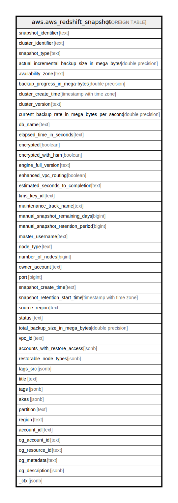

# aws.aws_redshift_snapshot

## Description

AWS Redshift Snapshot

## Columns

| Name | Type | Default | Nullable | Children | Parents | Comment |
| ---- | ---- | ------- | -------- | -------- | ------- | ------- |
| snapshot_identifier | text |  | true |  |  | The unique identifier of the cluster. |
| cluster_identifier | text |  | true |  |  | The identifier of the cluster for which the snapshot was taken. |
| snapshot_type | text |  | true |  |  | The snapshot type. |
| actual_incremental_backup_size_in_mega_bytes | double precision |  | true |  |  | The size of the incremental backup. |
| availability_zone | text |  | true |  |  | The Availability Zone in which the cluster was created. |
| backup_progress_in_mega-bytes | double precision |  | true |  |  | The number of megabytes that have been transferred to the snapshot backup. |
| cluster_create_time | timestamp with time zone |  | true |  |  | The time (UTC) when the cluster was originally created. |
| cluster_version | text |  | true |  |  | The version ID of the Amazon Redshift engine that is running on the cluster. |
| current_backup_rate_in_mega_bytes_per_second | double precision |  | true |  |  | The number of megabytes per second being transferred to the snapshot backup. |
| db_name | text |  | true |  |  | The name of the database that was created when the cluster was created. |
| elapsed_time_in_seconds | text |  | true |  |  | The amount of time an in-progress snapshot backup has been running, or the amount of time it took a completed backup to finish. |
| encrypted | boolean |  | true |  |  | If true, the data in the snapshot is encrypted at rest. |
| encrypted_with_hsm | boolean |  | true |  |  | A boolean that indicates whether the snapshot data is encrypted using the HSM keys of the source cluster. |
| engine_full_version | text |  | true |  |  | The cluster version of the cluster used to create the snapshot. |
| enhanced_vpc_routing | boolean |  | true |  |  | An option that specifies whether to create the cluster with enhanced VPC routing enabled. |
| estimated_seconds_to_completion | text |  | true |  |  | The estimate of the time remaining before the snapshot backup will complete. |
| kms_key_id | text |  | true |  |  | The AWS KMS key ID of the encryption key that was used to encrypt data in the cluster from which the snapshot was taken. |
| maintenance_track_name | text |  | true |  |  | The name of the maintenance track for the snapshot. |
| manual_snapshot_remaining_days | bigint |  | true |  |  | The number of days until a manual snapshot will pass its retention period. |
| manual_snapshot_retention_period | bigint |  | true |  |  | The number of days that a manual snapshot is retained. |
| master_username | text |  | true |  |  | The master user name for the cluster. |
| node_type | text |  | true |  |  | The node type of the nodes in the cluster. |
| number_of_nodes | bigint |  | true |  |  | The number of nodes in the cluster. |
| owner_account | text |  | true |  |  | The AWS customer account used to create or copy the snapshot. |
| port | bigint |  | true |  |  | The port that the cluster is listening on. |
| snapshot_create_time | text |  | true |  |  | The time (in UTC format) when Amazon Redshift began the snapshot. |
| snapshot_retention_start_time | timestamp with time zone |  | true |  |  | A timestamp representing the start of the retention period for the snapshot. |
| source_region | text |  | true |  |  | The source region from which the snapshot was copied. |
| status | text |  | true |  |  | The snapshot status. |
| total_backup_size_in_mega_bytes | double precision |  | true |  |  | The size of the complete set of backup data that would be used to restore the cluster. |
| vpc_id | text |  | true |  |  | The VPC identifier of the cluster if the snapshot is from a cluster in a VPC. |
| accounts_with_restore_access | jsonb |  | true |  |  | A list of the AWS customer accounts authorized to restore the snapshot. |
| restorable_node_types | jsonb |  | true |  |  | The list of node types that this cluster snapshot is able to restore into. |
| tags_src | jsonb |  | true |  |  | The list of tags for the cluster. |
| title | text |  | true |  |  | Title of the resource. |
| tags | jsonb |  | true |  |  | A map of tags for the resource. |
| akas | jsonb |  | true |  |  | Array of globally unique identifier strings (also known as) for the resource. |
| partition | text |  | true |  |  | The AWS partition in which the resource is located (aws, aws-cn, or aws-us-gov). |
| region | text |  | true |  |  | The AWS Region in which the resource is located. |
| account_id | text |  | true |  |  | The AWS Account ID in which the resource is located. |
| og_account_id | text |  | true |  |  | The Platform Account ID in which the resource is located. |
| og_resource_id | text |  | true |  |  | The unique ID of the resource in opengovernance. |
| og_metadata | text |  | true |  |  | Platform Metadata of the AWS resource. |
| og_description | jsonb |  | true |  |  | The full model description of the resource |
| _ctx | jsonb |  | true |  |  | Steampipe context in JSON form, e.g. connection_name. |

## Relations

---

> Generated by [tbls](https://github.com/k1LoW/tbls)
