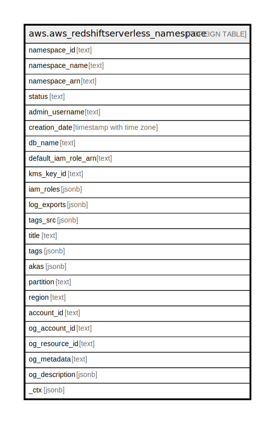

# aws.aws_redshiftserverless_namespace

## Description

AWS Redshift Serverless Namespace

## Columns

| Name | Type | Default | Nullable | Children | Parents | Comment |
| ---- | ---- | ------- | -------- | -------- | ------- | ------- |
| namespace_id | text |  | true |  |  | The id of the namespace. |
| namespace_name | text |  | true |  |  | The name of the namespace. |
| namespace_arn | text |  | true |  |  | The Amazon Resource Name (ARN) of the namespace |
| status | text |  | true |  |  | The status of the namespace. |
| admin_username | text |  | true |  |  | The username of the administrator for the first database created in the namespace. |
| creation_date | timestamp with time zone |  | true |  |  | The creation date of the namespace. |
| db_name | text |  | true |  |  | The name of the first database created in the namespace. |
| default_iam_role_arn | text |  | true |  |  | The Amazon Resource Name (ARN) of the IAM role to set as a default in the namespace. |
| kms_key_id | text |  | true |  |  | The ID of the Amazon Web Services Key Management Service key used to encrypt your data. |
| iam_roles | jsonb |  | true |  |  | A list of IAM roles to associate with the namespace. |
| log_exports | jsonb |  | true |  |  | The types of logs the namespace can export. Available export types are User log, Connection log, and User activity log. |
| tags_src | jsonb |  | true |  |  | The list of tags for the namespace. |
| title | text |  | true |  |  | Title of the resource. |
| tags | jsonb |  | true |  |  | A map of tags for the resource. |
| akas | jsonb |  | true |  |  | Array of globally unique identifier strings (also known as) for the resource. |
| partition | text |  | true |  |  | The AWS partition in which the resource is located (aws, aws-cn, or aws-us-gov). |
| region | text |  | true |  |  | The AWS Region in which the resource is located. |
| account_id | text |  | true |  |  | The AWS Account ID in which the resource is located. |
| og_account_id | text |  | true |  |  | The Platform Account ID in which the resource is located. |
| og_resource_id | text |  | true |  |  | The unique ID of the resource in opengovernance. |
| og_metadata | text |  | true |  |  | Platform Metadata of the AWS resource. |
| og_description | jsonb |  | true |  |  | The full model description of the resource |
| _ctx | jsonb |  | true |  |  | Steampipe context in JSON form, e.g. connection_name. |

## Relations

---

> Generated by [tbls](https://github.com/k1LoW/tbls)
