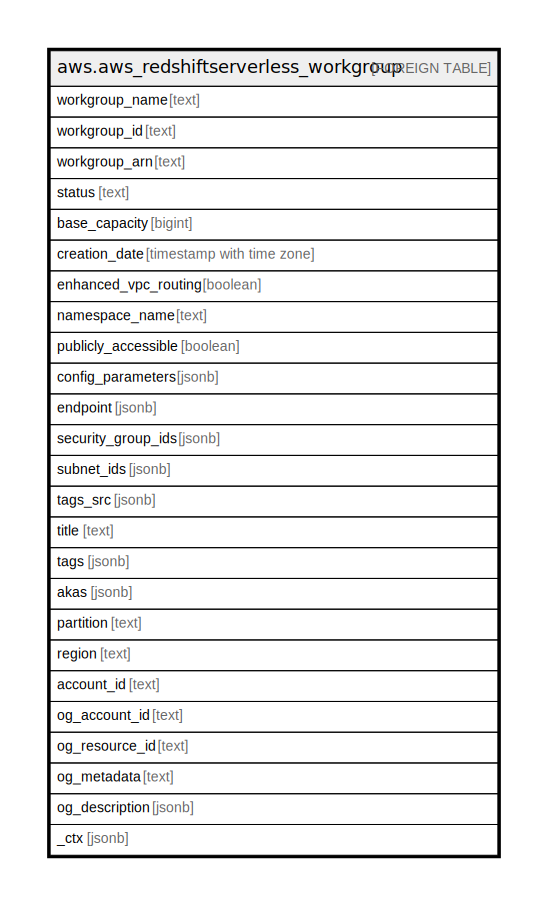

# aws.aws_redshiftserverless_workgroup

## Description

AWS Redshift Serverless Workgroup

## Columns

| Name | Type | Default | Nullable | Children | Parents | Comment |
| ---- | ---- | ------- | -------- | -------- | ------- | ------- |
| workgroup_name | text |  | true |  |  | The name of the workgroup. |
| workgroup_id | text |  | true |  |  | The unique identifier of the workgroup. |
| workgroup_arn | text |  | true |  |  | The Amazon Resource Name (ARN) that links to the workgroup. |
| status | text |  | true |  |  | The status of the workgroup. |
| base_capacity | bigint |  | true |  |  | The base data warehouse capacity of the workgroup in Redshift Processing Units (RPUs). |
| creation_date | timestamp with time zone |  | true |  |  | The creation date of the workgroup. |
| enhanced_vpc_routing | boolean |  | true |  |  | The value that specifies whether to enable enhanced virtual private cloud (VPC) routing, which forces Amazon Redshift Serverless to route traffic through your VPC. |
| namespace_name | text |  | true |  |  | The namespace the workgroup is associated with. |
| publicly_accessible | boolean |  | true |  |  | A value that specifies whether the workgroup can be accessible from a public network. |
| config_parameters | jsonb |  | true |  |  | An array of parameters to set for finer control over a database. |
| endpoint | jsonb |  | true |  |  | The endpoint that is created from the workgroup. |
| security_group_ids | jsonb |  | true |  |  | An array of security group IDs to associate with the workgroup. |
| subnet_ids | jsonb |  | true |  |  | An array of subnet IDs the workgroup is associated with. |
| tags_src | jsonb |  | true |  |  | The list of tags for the workgroup. |
| title | text |  | true |  |  | Title of the resource. |
| tags | jsonb |  | true |  |  | A map of tags for the resource. |
| akas | jsonb |  | true |  |  | Array of globally unique identifier strings (also known as) for the resource. |
| partition | text |  | true |  |  | The AWS partition in which the resource is located (aws, aws-cn, or aws-us-gov). |
| region | text |  | true |  |  | The AWS Region in which the resource is located. |
| account_id | text |  | true |  |  | The AWS Account ID in which the resource is located. |
| og_account_id | text |  | true |  |  | The Platform Account ID in which the resource is located. |
| og_resource_id | text |  | true |  |  | The unique ID of the resource in opengovernance. |
| og_metadata | text |  | true |  |  | Platform Metadata of the AWS resource. |
| og_description | jsonb |  | true |  |  | The full model description of the resource |
| _ctx | jsonb |  | true |  |  | Steampipe context in JSON form, e.g. connection_name. |

## Relations

---

> Generated by [tbls](https://github.com/k1LoW/tbls)
