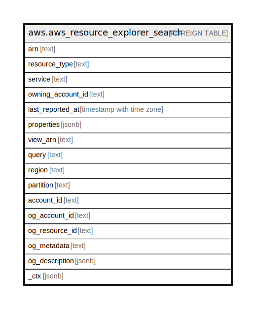

# aws.aws_resource_explorer_search

## Description

AWS Resource Explorer Search

## Columns

| Name | Type | Default | Nullable | Children | Parents | Comment |
| ---- | ---- | ------- | -------- | -------- | ------- | ------- |
| arn | text |  | true |  |  | The Amazon resource name (ARN) of the resource. |
| resource_type | text |  | true |  |  | The type of the resource. |
| service | text |  | true |  |  | The Amazon Web Service that owns the resource and is responsible for creating and updating it. |
| owning_account_id | text |  | true |  |  | The Amazon Web Services account that owns the resource. |
| last_reported_at | timestamp with time zone |  | true |  |  | The date and time that Resource Explorer last queried this resource and updated the index with the latest information about the resource. |
| properties | jsonb |  | true |  |  | Additional type-specific details about the resource. |
| view_arn | text |  | true |  |  | The Amazon resource name (ARN) of the view that this table uses to perform the search. |
| query | text |  | true |  |  | A string that includes keywords and filters that specify the resources to include in the search results. |
| region | text |  | true |  |  | The AWS Region in which the resource was created and exists. |
| partition | text |  | true |  |  | The AWS partition in which the resource is located (aws, aws-cn, or aws-us-gov). |
| account_id | text |  | true |  |  | The AWS Account ID in which the resource is located. |
| og_account_id | text |  | true |  |  | The Platform Account ID in which the resource is located. |
| og_resource_id | text |  | true |  |  | The unique ID of the resource in opengovernance. |
| og_metadata | text |  | true |  |  | Platform Metadata of the AWS resource. |
| og_description | jsonb |  | true |  |  | The full model description of the resource |
| _ctx | jsonb |  | true |  |  | Steampipe context in JSON form, e.g. connection_name. |

## Relations

---

> Generated by [tbls](https://github.com/k1LoW/tbls)
