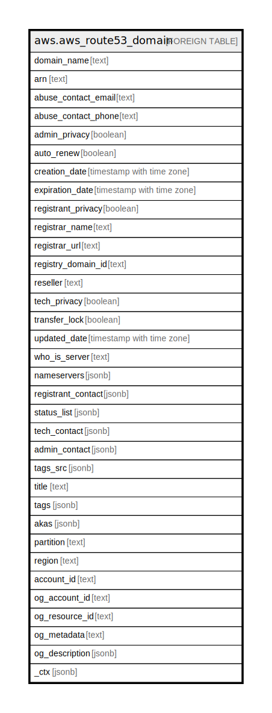

# aws.aws_route53_domain

## Description

AWS Route53 Domain

## Columns

| Name | Type | Default | Nullable | Children | Parents | Comment |
| ---- | ---- | ------- | -------- | -------- | ------- | ------- |
| domain_name | text |  | true |  |  | The name of the domain. |
| arn | text |  | true |  |  | The Amazon Resource Name (ARN) specifying the domain. |
| abuse_contact_email | text |  | true |  |  | Email address to contact to report incorrect contact information for a domain,to report that the domain is being used to send spam, to report that someone is cyber squatting on a domain name, or report some other type of abuse. |
| abuse_contact_phone | text |  | true |  |  | Phone number for reporting abuse. |
| admin_privacy | boolean |  | true |  |  | Specifies whether contact information is concealed from WHOIS queries. |
| auto_renew | boolean |  | true |  |  | Indicates whether the domain is automatically renewed upon expiration. |
| creation_date | timestamp with time zone |  | true |  |  | The date when the domain was created as found in the response to a WHOIS query. |
| expiration_date | timestamp with time zone |  | true |  |  | The date when the registration for the domain is set to expire. The date and time is in Unix time format and Coordinated Universal time (UTC). |
| registrant_privacy | boolean |  | true |  |  | Specifies whether contact information is concealed from WHOIS queries. |
| registrar_name | text |  | true |  |  | Name of the registrar of the domain as identified in the registry. Domains with a .com, .net, or .org TLD are registered by Amazon Registrar. |
| registrar_url | text |  | true |  |  | Web address of the registrar. |
| registry_domain_id | text |  | true |  |  | Reserved for future use. |
| reseller | text |  | true |  |  | Reseller of the domain. Domains registered or transferred using Route 53 domains will have Amazon as the reseller. |
| tech_privacy | boolean |  | true |  |  | Specifies whether contact information is concealed from WHOIS queries. |
| transfer_lock | boolean |  | true |  |  | Indicates whether a domain is locked from unauthorized transfer to another party. |
| updated_date | timestamp with time zone |  | true |  |  | The last updated date of the domain as found in the response to a WHOIS query.The date and time is in Unix time format and Coordinated Universal time (UTC). |
| who_is_server | text |  | true |  |  | The fully qualified name of the WHOIS server that can answer the WHOIS query for the domain. |
| nameservers | jsonb |  | true |  |  | The name of the domain. |
| registrant_contact | jsonb |  | true |  |  | Provides details about the domain registrant. |
| status_list | jsonb |  | true |  |  | An array of domain name status codes, also known as Extensible Provisioning Protocol (EPP) status codes. |
| tech_contact | jsonb |  | true |  |  | Provides details about the domain technical contact. |
| admin_contact | jsonb |  | true |  |  | Provides details about the domain administrative contact. |
| tags_src | jsonb |  | true |  |  | A list of tags assigned to the resource. |
| title | text |  | true |  |  | Title of the resource. |
| tags | jsonb |  | true |  |  | A map of tags for the resource. |
| akas | jsonb |  | true |  |  | Array of globally unique identifier strings (also known as) for the resource. |
| partition | text |  | true |  |  | The AWS partition in which the resource is located (aws, aws-cn, or aws-us-gov). |
| region | text |  | true |  |  | The AWS Region in which the resource is located. |
| account_id | text |  | true |  |  | The AWS Account ID in which the resource is located. |
| og_account_id | text |  | true |  |  | The Platform Account ID in which the resource is located. |
| og_resource_id | text |  | true |  |  | The unique ID of the resource in opengovernance. |
| og_metadata | text |  | true |  |  | Platform Metadata of the AWS resource. |
| og_description | jsonb |  | true |  |  | The full model description of the resource |
| _ctx | jsonb |  | true |  |  | Steampipe context in JSON form, e.g. connection_name. |

## Relations

---

> Generated by [tbls](https://github.com/k1LoW/tbls)
