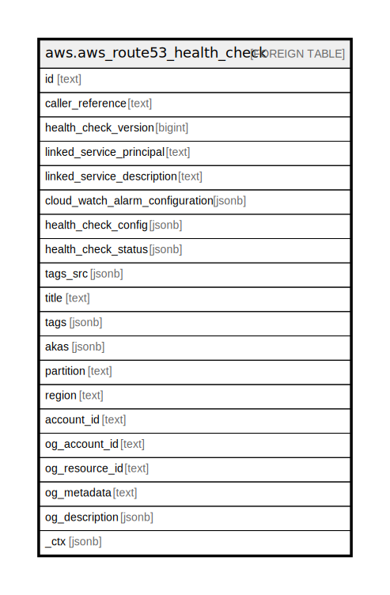

# aws.aws_route53_health_check

## Description

AWS Route53 Health Check

## Columns

| Name | Type | Default | Nullable | Children | Parents | Comment |
| ---- | ---- | ------- | -------- | -------- | ------- | ------- |
| id | text |  | true |  |  | The identifier that Amazon Route 53 assigned to the health check. |
| caller_reference | text |  | true |  |  | A unique string that you specified when you created the health check. |
| health_check_version | bigint |  | true |  |  | The version of the health check. |
| linked_service_principal | text |  | true |  |  | If the health check was created by another service, the service that created the resource. |
| linked_service_description | text |  | true |  |  | If the health check was created by another service, an configurationtional description that can be provided by the other service. |
| cloud_watch_alarm_configuration | jsonb |  | true |  |  | A complex type that contains information about the CloudWatch alarm that Amazon Route 53 is monitoring for this health check. |
| health_check_config | jsonb |  | true |  |  | A complex type that contains detailed information about one health check. |
| health_check_status | jsonb |  | true |  |  | A list that contains one HealthCheckObservation element for each Amazon Route 53 health checker that is reporting a status about the health check endpoint. |
| tags_src | jsonb |  | true |  |  | A map of tags for the resource. |
| title | text |  | true |  |  | Title of the resource. |
| tags | jsonb |  | true |  |  | A map of tags for the resource. |
| akas | jsonb |  | true |  |  | Array of globally unique identifier strings (also known as) for the resource. |
| partition | text |  | true |  |  | The AWS partition in which the resource is located (aws, aws-cn, or aws-us-gov). |
| region | text |  | true |  |  | The AWS Region in which the resource is located. |
| account_id | text |  | true |  |  | The AWS Account ID in which the resource is located. |
| og_account_id | text |  | true |  |  | The Platform Account ID in which the resource is located. |
| og_resource_id | text |  | true |  |  | The unique ID of the resource in opengovernance. |
| og_metadata | text |  | true |  |  | Platform Metadata of the AWS resource. |
| og_description | jsonb |  | true |  |  | The full model description of the resource |
| _ctx | jsonb |  | true |  |  | Steampipe context in JSON form, e.g. connection_name. |

## Relations

---

> Generated by [tbls](https://github.com/k1LoW/tbls)
