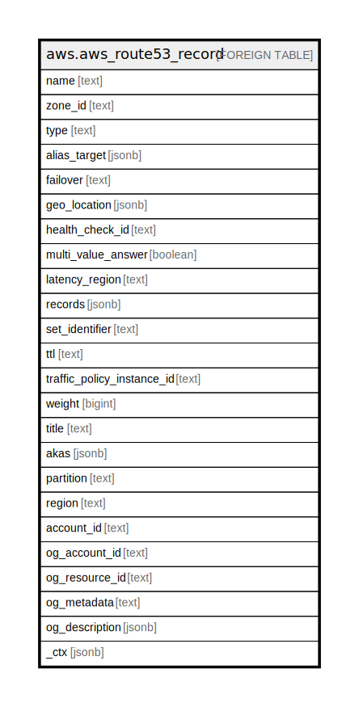

# aws.aws_route53_record

## Description

AWS Route53 Record

## Columns

| Name | Type | Default | Nullable | Children | Parents | Comment |
| ---- | ---- | ------- | -------- | -------- | ------- | ------- |
| name | text |  | true |  |  | The name of the record. |
| zone_id | text |  | true |  |  | The ID of the hosted zone to contain this record. |
| type | text |  | true |  |  | The record type. Valid values are A, AAAA, CAA, CNAME, MX, NAPTR, NS, PTR, SOA, SPF, SRV and TXT. |
| alias_target | jsonb |  | true |  |  | Alias resource record sets only: Information about the AWS resource, such as a CloudFront distribution or an Amazon S3 bucket, that you want to route traffic to. |
| failover | text |  | true |  |  | Failover resource record sets only: To configure failover, you add the Failover element to two resource record sets. For one resource record set, you specify PRIMARY as the value for Failover; for the other resource record set, you specify SECONDARY. In addition, you include the HealthCheckId element and specify the health check that you want Amazon Route 53 to perform for each resource record set. |
| geo_location | jsonb |  | true |  |  | Geolocation resource record sets only: A complex type that lets you control how Amazon Route 53 responds to DNS queries based on the geographic origin of the query. For example, if you want all queries from Africa to be routed to a web server with an IP address of 192.0.2.111, create a resource record set with a Type of A and a ContinentCode of AF. |
| health_check_id | text |  | true |  |  | The health check the record should be associated with. |
| multi_value_answer | boolean |  | true |  |  | Multivalue answer resource record sets only: To route traffic approximately randomly to multiple resources, such as web servers, create one multivalue answer record for each resource and specify true for MultiValueAnswer. |
| latency_region | text |  | true |  |  | An AWS region from which to measure latency |
| records | jsonb |  | true |  |  | If the health check or hosted zone was created by another service, an optional description that can be provided by the other service. |
| set_identifier | text |  | true |  |  | Unique identifier to differentiate records with routing policies from one another. |
| ttl | text |  | true |  |  | The resource record cache time to live (TTL), in seconds. |
| traffic_policy_instance_id | text |  | true |  |  | The ID of the traffic policy instance that Route 53 created this resource record set for. |
| weight | bigint |  | true |  |  | Weighted resource record sets only: Among resource record sets that have the same combination of DNS name and type, a value that determines the proportion of DNS queries that Amazon Route 53 responds to using the current resource record set. Route 53 calculates the sum of the weights for the resource record sets that have the same combination of DNS name and type. Route 53 then responds to queries based on the ratio of a resource's weight to the total. |
| title | text |  | true |  |  | Title of the resource. |
| akas | jsonb |  | true |  |  | Array of globally unique identifier strings (also known as) for the resource. |
| partition | text |  | true |  |  | The AWS partition in which the resource is located (aws, aws-cn, or aws-us-gov). |
| region | text |  | true |  |  | The AWS Region in which the resource is located. |
| account_id | text |  | true |  |  | The AWS Account ID in which the resource is located. |
| og_account_id | text |  | true |  |  | The Platform Account ID in which the resource is located. |
| og_resource_id | text |  | true |  |  | The unique ID of the resource in opengovernance. |
| og_metadata | text |  | true |  |  | Platform Metadata of the AWS resource. |
| og_description | jsonb |  | true |  |  | The full model description of the resource |
| _ctx | jsonb |  | true |  |  | Steampipe context in JSON form, e.g. connection_name. |

## Relations

---

> Generated by [tbls](https://github.com/k1LoW/tbls)
