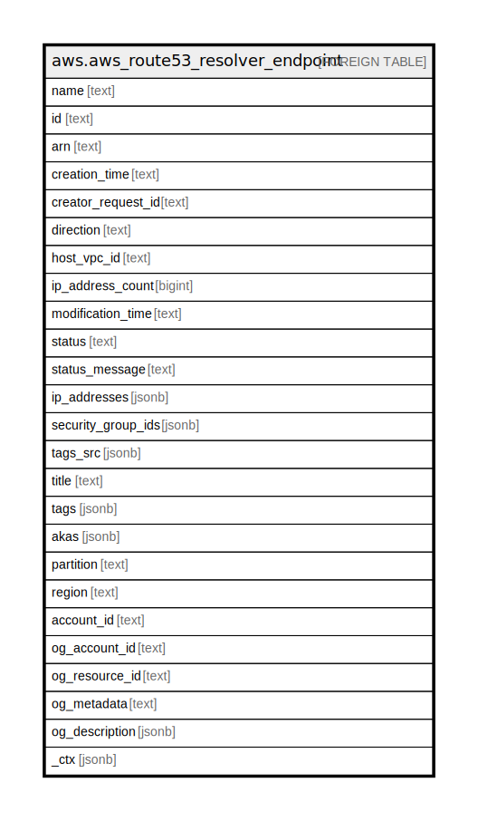

# aws.aws_route53_resolver_endpoint

## Description

AWS Route53 Resolver Endpoint

## Columns

| Name | Type | Default | Nullable | Children | Parents | Comment |
| ---- | ---- | ------- | -------- | -------- | ------- | ------- |
| name | text |  | true |  |  | The name that you assigned to the Resolver endpoint when you submitted a CreateResolverEndpoint. |
| id | text |  | true |  |  | The ID of the Resolver endpoint. |
| arn | text |  | true |  |  | The ARN (Amazon Resource Name) for the Resolver endpoint. |
| creation_time | text |  | true |  |  | The date and time that the endpoint was created, in Unix time format and Coordinated Universal Time (UTC). |
| creator_request_id | text |  | true |  |  | A unique string that identifies the request that created the Resolver endpoint.The CreatorRequestId allows failed requests to be retried without the risk of executing the operation twice. |
| direction | text |  | true |  |  | Indicates whether the Resolver endpoint allows inbound or outbound DNS queries. |
| host_vpc_id | text |  | true |  |  | The ID of the VPC that you want to create the Resolver endpoint in. |
| ip_address_count | bigint |  | true |  |  | The number of IP addresses that the Resolver endpoint can use for DNS queries. |
| modification_time | text |  | true |  |  | The date and time that the endpoint was last modified, in Unix time format and Coordinated Universal Time (UTC). |
| status | text |  | true |  |  | A code that specifies the current status of the Resolver endpoint. |
| status_message | text |  | true |  |  | A detailed description of the status of the Resolver endpoint. |
| ip_addresses | jsonb |  | true |  |  | Information about the IP addresses in your VPC that DNS queries originate from (for outbound endpoints) or that you forward DNS queries to (for inbound endpoints). |
| security_group_ids | jsonb |  | true |  |  | The ID of one or more security groups that control access to this VPC. |
| tags_src | jsonb |  | true |  |  | A list of tags assigned to the Resolver endpoint. |
| title | text |  | true |  |  | Title of the resource. |
| tags | jsonb |  | true |  |  | A map of tags for the resource. |
| akas | jsonb |  | true |  |  | Array of globally unique identifier strings (also known as) for the resource. |
| partition | text |  | true |  |  | The AWS partition in which the resource is located (aws, aws-cn, or aws-us-gov). |
| region | text |  | true |  |  | The AWS Region in which the resource is located. |
| account_id | text |  | true |  |  | The AWS Account ID in which the resource is located. |
| og_account_id | text |  | true |  |  | The Platform Account ID in which the resource is located. |
| og_resource_id | text |  | true |  |  | The unique ID of the resource in opengovernance. |
| og_metadata | text |  | true |  |  | Platform Metadata of the AWS resource. |
| og_description | jsonb |  | true |  |  | The full model description of the resource |
| _ctx | jsonb |  | true |  |  | Steampipe context in JSON form, e.g. connection_name. |

## Relations

---

> Generated by [tbls](https://github.com/k1LoW/tbls)
