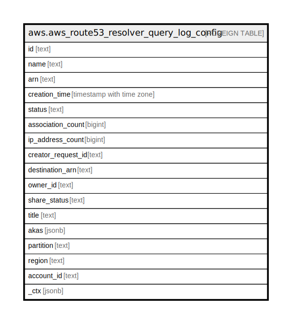

# aws.aws_route53_resolver_query_log_config

## Description

AWS Route53 Resolver Query Logging Configuration

## Columns

| Name | Type | Default | Nullable | Children | Parents | Comment |
| ---- | ---- | ------- | -------- | -------- | ------- | ------- |
| id | text |  | true |  |  | The ID for the query logging configuration. |
| name | text |  | true |  |  | The name of the query logging configuration. |
| arn | text |  | true |  |  | The ARN (Amazon Resource Name) for the query logging configuration. |
| creation_time | timestamp with time zone |  | true |  |  | The date and time that the query logging configuration was created, in Unix time format and Coordinated Universal Time (UTC). |
| status | text |  | true |  |  | The status of the specified query logging configuration. Valid values include CREATING|CREATED|DELETING|FAILED. |
| association_count | bigint |  | true |  |  | The number of VPCs that are associated with the query logging configuration. |
| ip_address_count | bigint |  | true |  |  | The number of IP addresses that you have associated with the Resolver endpoint. |
| creator_request_id | text |  | true |  |  | A unique string that identifies the request that created the query logging configuration. |
| destination_arn | text |  | true |  |  | The ARN of the resource that you want Resolver to send query logs: an Amazon S3 bucket, a CloudWatch Logs log group, or a Kinesis Data Firehose delivery stream. |
| owner_id | text |  | true |  |  | The Amazon Web Services account ID for the account that created the query logging configuration. |
| share_status | text |  | true |  |  | An indication of whether the query logging configuration is shared with other Amazon Web Services accounts, or was shared with the current account by another Amazon Web Services account. Sharing is configured through Resource Access Manager (RAM). |
| title | text |  | true |  |  | Title of the resource. |
| akas | jsonb |  | true |  |  | Array of globally unique identifier strings (also known as) for the resource. |
| partition | text |  | true |  |  | The AWS partition in which the resource is located (aws, aws-cn, or aws-us-gov). |
| region | text |  | true |  |  | The AWS Region in which the resource is located. |
| account_id | text |  | true |  |  | The AWS Account ID in which the resource is located. |
| _ctx | jsonb |  | true |  |  | Steampipe context in JSON form, e.g. connection_name. |

## Relations

---

> Generated by [tbls](https://github.com/k1LoW/tbls)
