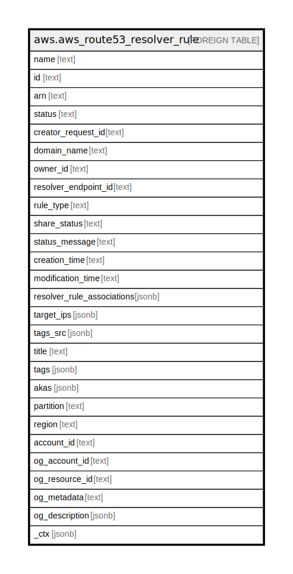

# aws.aws_route53_resolver_rule

## Description

AWS Route53 Resolver Rule

## Columns

| Name | Type | Default | Nullable | Children | Parents | Comment |
| ---- | ---- | ------- | -------- | -------- | ------- | ------- |
| name | text |  | true |  |  | The name for the Resolver rule, which you specified when you created the Resolver rule. |
| id | text |  | true |  |  | The ID that Resolver assigned to the Resolver rule when you created it. |
| arn | text |  | true |  |  | The ARN (Amazon Resource Name) for the Resolver rule specified by Id. |
| status | text |  | true |  |  | A code that specifies the current status of the Resolver rule. |
| creator_request_id | text |  | true |  |  | A unique string that you specified when you created the Resolver rule. CreatorRequestId identifies the request and allows failed requests to be retried without the risk of executing the operation twice. |
| domain_name | text |  | true |  |  | DNS queries for this domain name are forwarded to the IP addresses that are specified in TargetIps. |
| owner_id | text |  | true |  |  | When a rule is shared with another AWS account, the account ID of the account that the rule is shared with. |
| resolver_endpoint_id | text |  | true |  |  | The ID of the endpoint that the rule is associated with. |
| rule_type | text |  | true |  |  | When you want to forward DNS queries for specified domain name to resolvers on your network, specify FORWARD.When you have a forwarding rule to forward DNS queries for a domain to your network and you want Resolver to process queries for a subdomain of that domain, specify SYSTEM. |
| share_status | text |  | true |  |  | Indicates whether the rules is shared and, if so, whether the current account is sharing the rule with another account, or another account is sharing the rule with the current account. |
| status_message | text |  | true |  |  | A detailed description of the status of a Resolver rule. |
| creation_time | text |  | true |  |  | The date and time that the Resolver rule was created, in Unix time format and Coordinated Universal Time (UTC). |
| modification_time | text |  | true |  |  | The date and time that the Resolver rule was last updated, in Unix time format and Coordinated Universal Time (UTC). |
| resolver_rule_associations | jsonb |  | true |  |  | The associations that were created between Resolver rules and VPCs using the current AWS account, and that match the specified filters, if any. |
| target_ips | jsonb |  | true |  |  | An array that contains the IP addresses and ports that an outbound endpoint forwards DNS queries to. Typically, these are the IP addresses of DNS resolvers on your network. Specify IPv4 addresses. IPv6 is not supported. |
| tags_src | jsonb |  | true |  |  | A list of tags assigned to the Resolver Rule. |
| title | text |  | true |  |  | Title of the resource. |
| tags | jsonb |  | true |  |  | A map of tags for the resource. |
| akas | jsonb |  | true |  |  | Array of globally unique identifier strings (also known as) for the resource. |
| partition | text |  | true |  |  | The AWS partition in which the resource is located (aws, aws-cn, or aws-us-gov). |
| region | text |  | true |  |  | The AWS Region in which the resource is located. |
| account_id | text |  | true |  |  | The AWS Account ID in which the resource is located. |
| og_account_id | text |  | true |  |  | The Platform Account ID in which the resource is located. |
| og_resource_id | text |  | true |  |  | The unique ID of the resource in opengovernance. |
| og_metadata | text |  | true |  |  | Platform Metadata of the AWS resource. |
| og_description | jsonb |  | true |  |  | The full model description of the resource |
| _ctx | jsonb |  | true |  |  | Steampipe context in JSON form, e.g. connection_name. |

## Relations

---

> Generated by [tbls](https://github.com/k1LoW/tbls)
