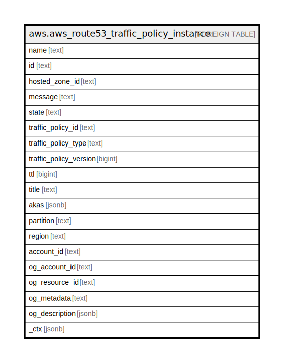

# aws.aws_route53_traffic_policy_instance

## Description

AWS Route53 Traffic Policy Instance

## Columns

| Name | Type | Default | Nullable | Children | Parents | Comment |
| ---- | ---- | ------- | -------- | -------- | ------- | ------- |
| name | text |  | true |  |  | The DNS name for which Amazon Route 53 responds to queries. |
| id | text |  | true |  |  | The id that Amazon Route 53 assigned to the new traffic policy instance. |
| hosted_zone_id | text |  | true |  |  | The id of the hosted zone that Amazon Route 53 created resource record sets in. |
| message | text |  | true |  |  | If State is Failed, an explanation of the reason for the failure. |
| state | text |  | true |  |  | Current state of the instance. |
| traffic_policy_id | text |  | true |  |  | The ID of the traffic policy that Amazon Route 53 used to create resource record sets in the specified hosted zone. |
| traffic_policy_type | text |  | true |  |  | The DNS type that Amazon Route 53 assigned to all of the resource record sets that it created for this traffic policy instance. |
| traffic_policy_version | bigint |  | true |  |  | The version of the traffic policy that Amazon Route 53 used to create resource record sets in the specified hosted zone. |
| ttl | bigint |  | true |  |  | The TTL that Amazon Route 53 assigned to all of the resource record sets that it created in the specified hosted zone. |
| title | text |  | true |  |  | Title of the resource. |
| akas | jsonb |  | true |  |  | Array of globally unique identifier strings (also known as) for the resource. |
| partition | text |  | true |  |  | The AWS partition in which the resource is located (aws, aws-cn, or aws-us-gov). |
| region | text |  | true |  |  | The AWS Region in which the resource is located. |
| account_id | text |  | true |  |  | The AWS Account ID in which the resource is located. |
| og_account_id | text |  | true |  |  | The Platform Account ID in which the resource is located. |
| og_resource_id | text |  | true |  |  | The unique ID of the resource in opengovernance. |
| og_metadata | text |  | true |  |  | Platform Metadata of the AWS resource. |
| og_description | jsonb |  | true |  |  | The full model description of the resource |
| _ctx | jsonb |  | true |  |  | Steampipe context in JSON form, e.g. connection_name. |

## Relations

---

> Generated by [tbls](https://github.com/k1LoW/tbls)
