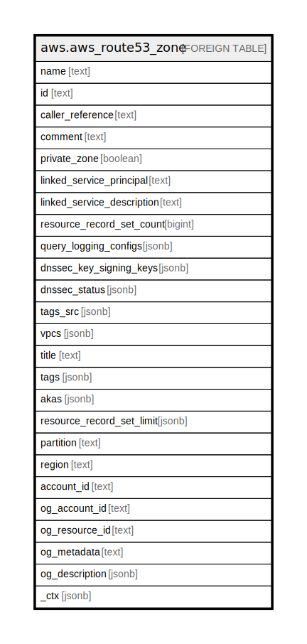

# aws.aws_route53_zone

## Description

AWS Route53 Zone

## Columns

| Name | Type | Default | Nullable | Children | Parents | Comment |
| ---- | ---- | ------- | -------- | -------- | ------- | ------- |
| name | text |  | true |  |  | The name of the domain. For public hosted zones, this is the name that is registered with your DNS registrar. |
| id | text |  | true |  |  | The ID that Amazon Route 53 assigned to the hosted zone when it was created. |
| caller_reference | text |  | true |  |  | The value that you specified for CallerReference when you created the hosted zone. |
| comment | text |  | true |  |  | A comment for the zone. |
| private_zone | boolean |  | true |  |  | If true, the zone is Private hosted Zone, otherwise it is public. |
| linked_service_principal | text |  | true |  |  | If the health check or hosted zone was created by another service, the service that created the resource. |
| linked_service_description | text |  | true |  |  | If the health check or hosted zone was created by another service, an optional description that can be provided by the other service. |
| resource_record_set_count | bigint |  | true |  |  | The number of resource record sets in the hosted zone. |
| query_logging_configs | jsonb |  | true |  |  | A list of configuration for DNS query logging that is associated with the current AWS account. |
| dnssec_key_signing_keys | jsonb |  | true |  |  | The key-signing keys (KSKs) in AWS account. |
| dnssec_status | jsonb |  | true |  |  | The status of DNSSEC. |
| tags_src | jsonb |  | true |  |  | A map of tags for the resource. |
| vpcs | jsonb |  | true |  |  | The list of VPCs that are authorized to be associated with the specified hosted zone. |
| title | text |  | true |  |  | Title of the resource. |
| tags | jsonb |  | true |  |  | A map of tags for the resource. |
| akas | jsonb |  | true |  |  | Array of globally unique identifier strings (also known as) for the resource. |
| resource_record_set_limit | jsonb |  | true |  |  | The maximum number of resource record sets allowed in the hosted zone. |
| partition | text |  | true |  |  | The AWS partition in which the resource is located (aws, aws-cn, or aws-us-gov). |
| region | text |  | true |  |  | The AWS Region in which the resource is located. |
| account_id | text |  | true |  |  | The AWS Account ID in which the resource is located. |
| og_account_id | text |  | true |  |  | The Platform Account ID in which the resource is located. |
| og_resource_id | text |  | true |  |  | The unique ID of the resource in opengovernance. |
| og_metadata | text |  | true |  |  | Platform Metadata of the AWS resource. |
| og_description | jsonb |  | true |  |  | The full model description of the resource |
| _ctx | jsonb |  | true |  |  | Steampipe context in JSON form, e.g. connection_name. |

## Relations

---

> Generated by [tbls](https://github.com/k1LoW/tbls)
