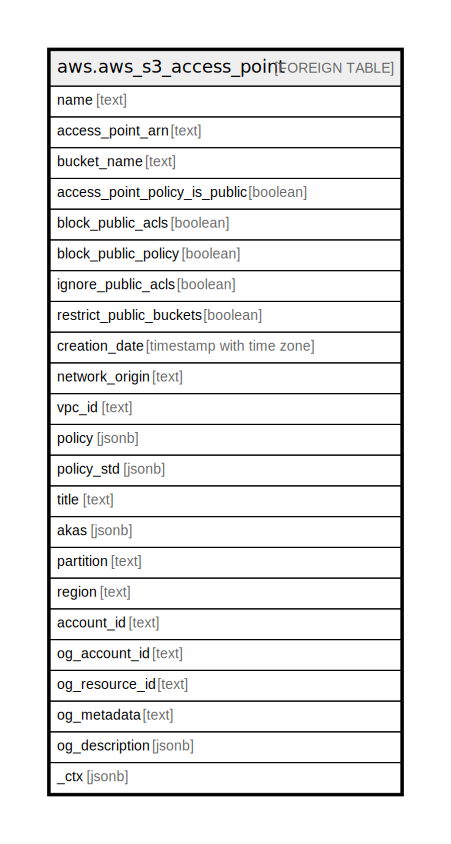

# aws.aws_s3_access_point

## Description

AWS S3 Access Point

## Columns

| Name | Type | Default | Nullable | Children | Parents | Comment |
| ---- | ---- | ------- | -------- | -------- | ------- | ------- |
| name | text |  | true |  |  | Specifies the name of the access point. |
| access_point_arn | text |  | true |  |  | Amazon Resource Name (ARN) of the access point. |
| bucket_name | text |  | true |  |  | The name of the bucket associated with this access point. |
| access_point_policy_is_public | boolean |  | true |  |  | Indicates whether this access point policy is public, or not. |
| block_public_acls | boolean |  | true |  |  | Specifies whether Amazon S3 should block public access control lists (ACLs) for buckets in this account. |
| block_public_policy | boolean |  | true |  |  | Specifies whether Amazon S3 should block public bucket policies for buckets in this account. |
| ignore_public_acls | boolean |  | true |  |  | Specifies whether Amazon S3 should ignore public ACLs for buckets in this account. |
| restrict_public_buckets | boolean |  | true |  |  | Specifies whether Amazon S3 should restrict public bucket policies for buckets in this account. |
| creation_date | timestamp with time zone |  | true |  |  | The date and time when the specified access point was created. |
| network_origin | text |  | true |  |  | Indicates whether this access point allows access from the public internet. If VpcConfiguration is specified for this access point, then NetworkOrigin is VPC, and the access point doesn't allow access from the public internet. |
| vpc_id | text |  | true |  |  | Specifies the VPC ID from which the access point will only allow connections. |
| policy | jsonb |  | true |  |  | The access point policy associated with the specified access point. |
| policy_std | jsonb |  | true |  |  | Contains the policy in a canonical form for easier searching. |
| title | text |  | true |  |  | Title of the resource. |
| akas | jsonb |  | true |  |  | Array of globally unique identifier strings (also known as) for the resource. |
| partition | text |  | true |  |  | The AWS partition in which the resource is located (aws, aws-cn, or aws-us-gov). |
| region | text |  | true |  |  | The AWS Region in which the resource is located. |
| account_id | text |  | true |  |  | The AWS Account ID in which the resource is located. |
| og_account_id | text |  | true |  |  | The Platform Account ID in which the resource is located. |
| og_resource_id | text |  | true |  |  | The unique ID of the resource in opengovernance. |
| og_metadata | text |  | true |  |  | Platform Metadata of the AWS resource. |
| og_description | jsonb |  | true |  |  | The full model description of the resource |
| _ctx | jsonb |  | true |  |  | Steampipe context in JSON form, e.g. connection_name. |

## Relations

---

> Generated by [tbls](https://github.com/k1LoW/tbls)
