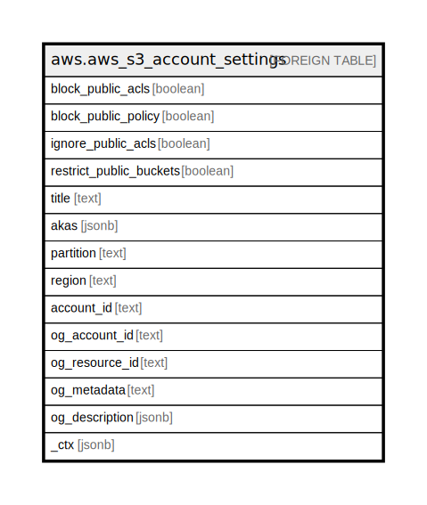

# aws.aws_s3_account_settings

## Description

AWS S3 Account Block Public Access Settings

## Columns

| Name | Type | Default | Nullable | Children | Parents | Comment |
| ---- | ---- | ------- | -------- | -------- | ------- | ------- |
| block_public_acls | boolean |  | true |  |  | Specifies whether Amazon S3 should block public access control lists (ACLs) for this bucket and objects in this bucket |
| block_public_policy | boolean |  | true |  |  | Specifies whether Amazon S3 should block public bucket policies for this bucket. If TRUE it causes Amazon S3 to reject calls to PUT Bucket policy if the specified bucket policy allows public access |
| ignore_public_acls | boolean |  | true |  |  | Specifies whether Amazon S3 should ignore public ACLs for this bucket and objects in this bucket. Setting this element to TRUE causes Amazon S3 to ignore all public ACLs on this bucket and objects in this bucket |
| restrict_public_buckets | boolean |  | true |  |  | Specifies whether Amazon S3 should restrict public bucket policies for this bucket. Setting this element to TRUE restricts access to this bucket to only AWS service principals and authorized users within this account if the bucket has a public policy |
| title | text |  | true |  |  | Title of the resource. |
| akas | jsonb |  | true |  |  | Array of globally unique identifier strings (also known as) for the resource. |
| partition | text |  | true |  |  | The AWS partition in which the resource is located (aws, aws-cn, or aws-us-gov). |
| region | text |  | true |  |  | The AWS Region in which the resource is located. |
| account_id | text |  | true |  |  | The AWS Account ID in which the resource is located. |
| og_account_id | text |  | true |  |  | The Platform Account ID in which the resource is located. |
| og_resource_id | text |  | true |  |  | The unique ID of the resource in opengovernance. |
| og_metadata | text |  | true |  |  | Platform Metadata of the AWS resource. |
| og_description | jsonb |  | true |  |  | The full model description of the resource |
| _ctx | jsonb |  | true |  |  | Steampipe context in JSON form, e.g. connection_name. |

## Relations

---

> Generated by [tbls](https://github.com/k1LoW/tbls)
