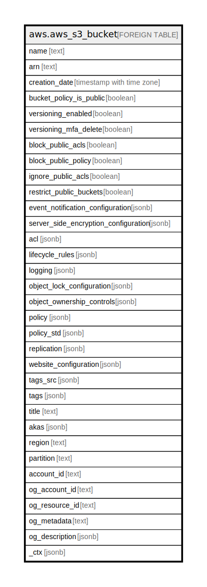

# aws.aws_s3_bucket

## Description

AWS S3 Bucket

## Columns

| Name | Type | Default | Nullable | Children | Parents | Comment |
| ---- | ---- | ------- | -------- | -------- | ------- | ------- |
| name | text |  | true |  |  | The user friendly name of the bucket. |
| arn | text |  | true |  |  | The ARN of the AWS S3 Bucket. |
| creation_date | timestamp with time zone |  | true |  |  | The date and tiem when bucket was created. |
| bucket_policy_is_public | boolean |  | true |  |  | The policy status for an Amazon S3 bucket, indicating whether the bucket is public. |
| versioning_enabled | boolean |  | true |  |  | The versioning state of a bucket. |
| versioning_mfa_delete | boolean |  | true |  |  | The MFA Delete status of the versioning state. |
| block_public_acls | boolean |  | true |  |  | Specifies whether Amazon S3 should block public access control lists (ACLs) for this bucket and objects in this bucket. |
| block_public_policy | boolean |  | true |  |  | Specifies whether Amazon S3 should block public bucket policies for this bucket. If TRUE it causes Amazon S3 to reject calls to PUT Bucket policy if the specified bucket policy allows public access. |
| ignore_public_acls | boolean |  | true |  |  | Specifies whether Amazon S3 should ignore public ACLs for this bucket and objects in this bucket. Setting this element to TRUE causes Amazon S3 to ignore all public ACLs on this bucket and objects in this bucket. |
| restrict_public_buckets | boolean |  | true |  |  | Specifies whether Amazon S3 should restrict public bucket policies for this bucket. Setting this element to TRUE restricts access to this bucket to only AWS service principals and authorized users within this account if the bucket has a public policy. |
| event_notification_configuration | jsonb |  | true |  |  | A container for specifying the notification configuration of the bucket. If this element is empty, notifications are turned off for the bucket. |
| server_side_encryption_configuration | jsonb |  | true |  |  | The default encryption configuration for an Amazon S3 bucket. |
| acl | jsonb |  | true |  |  | The access control list (ACL) of a bucket. |
| lifecycle_rules | jsonb |  | true |  |  | The lifecycle configuration information of the bucket. |
| logging | jsonb |  | true |  |  | The logging status of a bucket and the permissions users have to view and modify that status. |
| object_lock_configuration | jsonb |  | true |  |  | The specified bucket's object lock configuration. |
| object_ownership_controls | jsonb |  | true |  |  | The Ownership Controls for an Amazon S3 bucket. |
| policy | jsonb |  | true |  |  | The resource IAM access document for the bucket. |
| policy_std | jsonb |  | true |  |  | Contains the policy in a canonical form for easier searching. |
| replication | jsonb |  | true |  |  | The replication configuration of a bucket. |
| website_configuration | jsonb |  | true |  |  | The website configuration information of the bucket. |
| tags_src | jsonb |  | true |  |  | A list of tags assigned to bucket. |
| tags | jsonb |  | true |  |  | A map of tags for the resource. |
| title | text |  | true |  |  | Title of the resource. |
| akas | jsonb |  | true |  |  | Array of globally unique identifier strings (also known as) for the resource. |
| region | text |  | true |  |  | The AWS Region in which the resource is located. |
| partition | text |  | true |  |  | The AWS partition in which the resource is located (aws, aws-cn, or aws-us-gov). |
| account_id | text |  | true |  |  | The AWS Account ID in which the resource is located. |
| og_account_id | text |  | true |  |  | The Platform Account ID in which the resource is located. |
| og_resource_id | text |  | true |  |  | The unique ID of the resource in opengovernance. |
| og_metadata | text |  | true |  |  | Platform Metadata of the AWS resource. |
| og_description | jsonb |  | true |  |  | The full model description of the resource |
| _ctx | jsonb |  | true |  |  | Steampipe context in JSON form, e.g. connection_name. |

## Relations

---

> Generated by [tbls](https://github.com/k1LoW/tbls)
