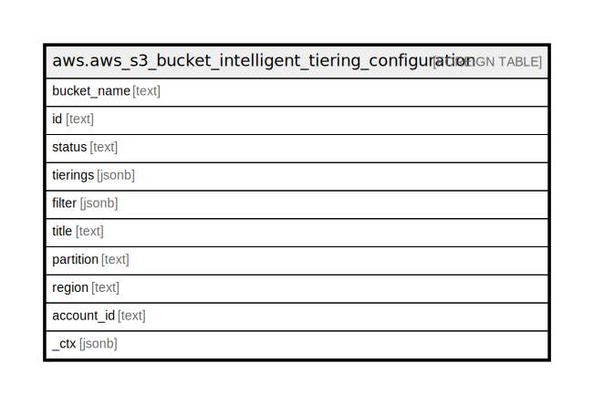

# aws.aws_s3_bucket_intelligent_tiering_configuration

## Description

AWS S3 Bucket Intelligent Tiering Configuration

## Columns

| Name | Type | Default | Nullable | Children | Parents | Comment |
| ---- | ---- | ------- | -------- | -------- | ------- | ------- |
| bucket_name | text |  | true |  |  | The name of the container bucket of this object. |
| id | text |  | true |  |  | The ID used to identify the S3 Intelligent-Tiering configuration. |
| status | text |  | true |  |  | Specifies the status of the configuration. |
| tierings | jsonb |  | true |  |  | Specifies the S3 Intelligent-Tiering storage class tier of the configuration. |
| filter | jsonb |  | true |  |  | Specifies a bucket filter. The configuration only includes objects that meet the filter's criteria. |
| title | text |  | true |  |  | Title of the resource. |
| partition | text |  | true |  |  | The AWS partition in which the resource is located (aws, aws-cn, or aws-us-gov). |
| region | text |  | true |  |  | The AWS Region in which the resource is located. |
| account_id | text |  | true |  |  | The AWS Account ID in which the resource is located. |
| _ctx | jsonb |  | true |  |  | Steampipe context in JSON form, e.g. connection_name. |

## Relations

---

> Generated by [tbls](https://github.com/k1LoW/tbls)
