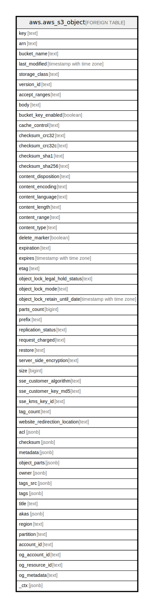

# aws.aws_s3_object

## Description

List AWS S3 Objects in S3 buckets by bucket name.

## Columns

| Name | Type | Default | Nullable | Children | Parents | Comment |
| ---- | ---- | ------- | -------- | -------- | ------- | ------- |
| key | text |  | true |  |  | The name that you assign to an object. You use the object key to retrieve the object. |
| arn | text |  | true |  |  | The ARN of the AWS S3 Object. |
| bucket_name | text |  | true |  |  | The name of the container bucket of this object. |
| last_modified | timestamp with time zone |  | true |  |  | Last modified time of the object. |
| storage_class | text |  | true |  |  | The class of storage used to store the object. |
| version_id | text |  | true |  |  | The version ID of the object. |
| accept_ranges | text |  | true |  |  | Indicates that a range of bytes was specified. |
| body | text |  | true |  |  | The raw bytes of the object data as a string. If the bytes entirely consists of valid UTF8 runes, an UTF8 is sent otherwise the bas64 encoding of the bytes is sent. |
| bucket_key_enabled | boolean |  | true |  |  | Indicates whether the object uses an S3 Bucket Key for server-side encryption with Amazon Web Services KMS (SSE-KMS) |
| cache_control | text |  | true |  |  | Specifies caching behavior along the request/reply chain. |
| checksum_crc32 | text |  | true |  |  | The base64-encoded, 32-bit CRC32 checksum of the object. This will only be present if it was uploaded with the object. With multipart uploads, this may not be a checksum value of the object. |
| checksum_crc32c | text |  | true |  |  | The base64-encoded, 32-bit CRC32C checksum of the object. This will only be present if it was uploaded with the object. With multipart uploads, this may not be a checksum value of the object. |
| checksum_sha1 | text |  | true |  |  | The base64-encoded, 160-bit SHA-1 digest of the object. This will only be present if it was uploaded with the object. With multipart uploads, this may not be a checksum value of the object. |
| checksum_sha256 | text |  | true |  |  | The base64-encoded, 256-bit SHA-256 digest of the object. This will only be present if it was uploaded with the object. With multipart uploads, this may not be a checksum value of the object. |
| content_disposition | text |  | true |  |  | Specifies presentational information for the object. |
| content_encoding | text |  | true |  |  | Specifies what content encodings have been applied to the object. |
| content_language | text |  | true |  |  | The language the content is in. |
| content_length | text |  | true |  |  | Size of the body in bytes. |
| content_range | text |  | true |  |  | The portion of the object returned in the response. |
| content_type | text |  | true |  |  | A standard MIME type describing the format of the object data. |
| delete_marker | boolean |  | true |  |  | Specifies whether the object retrieved was (true) or was not (false) a delete marker. |
| expiration | text |  | true |  |  | If the object expiration is configured (see PUT Bucket lifecycle), the response includes this header. It includes the expiry-date and rule-id key-value pairs providing object expiration information. The value of the rule-id is URL-encoded. |
| expires | timestamp with time zone |  | true |  |  | The date and time at which the object is no longer cacheable. |
| etag | text |  | true |  |  | The entity tag of the object. |
| object_lock_legal_hold_status | text |  | true |  |  | Like a retention period, a legal hold prevents an object version from being overwritten or deleted. A legal hold remains in effect until removed. |
| object_lock_mode | text |  | true |  |  | The Object Lock mode currently in place for this object. |
| object_lock_retain_until_date | timestamp with time zone |  | true |  |  | The date and time when this object's Object Lock will expire. |
| parts_count | bigint |  | true |  |  | The count of parts this object has. This value is only returned if you specify partNumber in your request and the object was uploaded as a multipart upload. |
| prefix | text |  | true |  |  | The prefix of the key of the object. |
| replication_status | text |  | true |  |  | Amazon S3 can return this if your request involves a bucket that is either a source or destination in a replication rule. |
| request_charged | text |  | true |  |  | If present, indicates that the requester was successfully charged for the request. |
| restore | text |  | true |  |  | Provides information about object restoration action and expiration time of the restored object copy. |
| server_side_encryption | text |  | true |  |  | The server-side encryption algorithm used when storing this object in Amazon S3. |
| size | bigint |  | true |  |  | Size in bytes of the object. |
| sse_customer_algorithm | text |  | true |  |  | If server-side encryption with a customer-provided encryption key was requested, the response will include this header confirming the encryption algorithm used. |
| sse_customer_key_md5 | text |  | true |  |  | If server-side encryption with a customer-provided encryption key was requested, the response will include this header to provide round-trip message integrity verification of the customer-provided encryption key. |
| sse_kms_key_id | text |  | true |  |  | If present, specifies the ID of the Amazon Web Services Key Management Service(Amazon Web Services KMS) symmetric customer managed key that was used for the object. |
| tag_count | text |  | true |  |  | The number of tags, if any, on the object. |
| website_redirection_location | text |  | true |  |  | If the bucket is configured as a website, redirects requests for this object  to another object in the same bucket or to an external URL. |
| acl | jsonb |  | true |  |  | ACLs define which AWS accounts or groups are granted access along with the type of access. |
| checksum | jsonb |  | true |  |  | The checksum or digest of the object. |
| metadata | jsonb |  | true |  |  | A map of metadata to store with the object in S3. |
| object_parts | jsonb |  | true |  |  | A collection of parts associated with a multipart upload. |
| owner | jsonb |  | true |  |  | The owner of the object. |
| tags_src | jsonb |  | true |  |  | A list of tags assigned to the object. |
| tags | jsonb |  | true |  |  | A map of tags for the resource. |
| title | text |  | true |  |  | Title of the resource. |
| akas | jsonb |  | true |  |  | Array of globally unique identifier strings (also known as) for the resource. |
| region | text |  | true |  |  | The AWS Region in which the object is located. |
| partition | text |  | true |  |  | The AWS partition in which the resource is located (aws, aws-cn, or aws-us-gov). |
| account_id | text |  | true |  |  | The AWS Account ID in which the resource is located. |
| og_account_id | text |  | true |  |  | The Platform Account ID in which the resource is located. |
| og_resource_id | text |  | true |  |  | The unique ID of the resource in opengovernance. |
| og_metadata | text |  | true |  |  | Platform Metadata of the AWS resource. |
| _ctx | jsonb |  | true |  |  | Steampipe context in JSON form, e.g. connection_name. |

## Relations

---

> Generated by [tbls](https://github.com/k1LoW/tbls)
