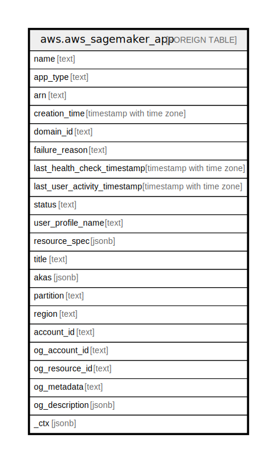

# aws.aws_sagemaker_app

## Description

AWS Sagemaker App

## Columns

| Name | Type | Default | Nullable | Children | Parents | Comment |
| ---- | ---- | ------- | -------- | -------- | ------- | ------- |
| name | text |  | true |  |  | The app name. |
| app_type | text |  | true |  |  | The type of app. |
| arn | text |  | true |  |  | The Amazon Resource Name (ARN) of the app. |
| creation_time | timestamp with time zone |  | true |  |  | A timestamp that indicates when the app was created. |
| domain_id | text |  | true |  |  | The domain ID. |
| failure_reason | text |  | true |  |  | The failure reason. |
| last_health_check_timestamp | timestamp with time zone |  | true |  |  | The timestamp of the last health check. |
| last_user_activity_timestamp | timestamp with time zone |  | true |  |  | The timestamp of the last user activity. |
| status | text |  | true |  |  | The status of the app. |
| user_profile_name | text |  | true |  |  | The user profile name. |
| resource_spec | jsonb |  | true |  |  | The instance type and the Amazon Resource Name (ARN) of the SageMaker image created on the instance. |
| title | text |  | true |  |  | Title of the resource. |
| akas | jsonb |  | true |  |  | Array of globally unique identifier strings (also known as) for the resource. |
| partition | text |  | true |  |  | The AWS partition in which the resource is located (aws, aws-cn, or aws-us-gov). |
| region | text |  | true |  |  | The AWS Region in which the resource is located. |
| account_id | text |  | true |  |  | The AWS Account ID in which the resource is located. |
| og_account_id | text |  | true |  |  | The Platform Account ID in which the resource is located. |
| og_resource_id | text |  | true |  |  | The unique ID of the resource in opengovernance. |
| og_metadata | text |  | true |  |  | Platform Metadata of the AWS resource. |
| og_description | jsonb |  | true |  |  | The full model description of the resource |
| _ctx | jsonb |  | true |  |  | Steampipe context in JSON form, e.g. connection_name. |

## Relations

---

> Generated by [tbls](https://github.com/k1LoW/tbls)
