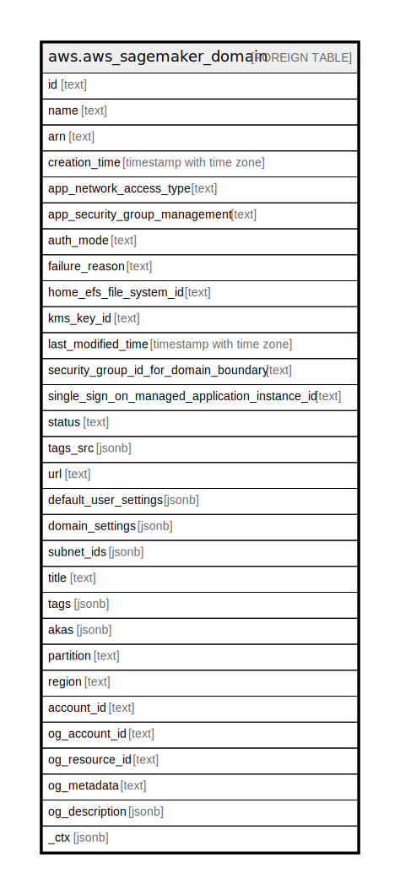

# aws.aws_sagemaker_domain

## Description

AWS Sagemaker Domain

## Columns

| Name | Type | Default | Nullable | Children | Parents | Comment |
| ---- | ---- | ------- | -------- | -------- | ------- | ------- |
| id | text |  | true |  |  | The domain ID. |
| name | text |  | true |  |  | The domain name. |
| arn | text |  | true |  |  | The Amazon Resource Name (ARN) of the domain. |
| creation_time | timestamp with time zone |  | true |  |  | A timestamp that indicates when the domain was created. |
| app_network_access_type | text |  | true |  |  | Specifies the VPC used for non-EFS traffic. |
| app_security_group_management | text |  | true |  |  | The entity that creates and manages the required security groups for inter-app communication in VPCOnly mode. |
| auth_mode | text |  | true |  |  | The domain's authentication mode. |
| failure_reason | text |  | true |  |  | The domain's failure reason. |
| home_efs_file_system_id | text |  | true |  |  | The ID of the Amazon Elastic File System (EFS) managed by this domain. |
| kms_key_id | text |  | true |  |  | The Amazon Web Services KMS customer managed key used to encrypt the EFS volume attached to the domain. |
| last_modified_time | timestamp with time zone |  | true |  |  | The domain's last modified time. |
| security_group_id_for_domain_boundary | text |  | true |  |  | The ID of the security group that authorizes traffic between the RSessionGateway apps and the RStudioServerPro app. |
| single_sign_on_managed_application_instance_id | text |  | true |  |  | The SSO managed application instance ID. |
| status | text |  | true |  |  | The domain's status. |
| tags_src | jsonb |  | true |  |  | The list of tags for the domain. |
| url | text |  | true |  |  | The domain's URL. |
| default_user_settings | jsonb |  | true |  |  | Settings which are applied to UserProfiles in this domain if settings are not explicitly specified in a given UserProfile. |
| domain_settings | jsonb |  | true |  |  | A collection of domain settings. |
| subnet_ids | jsonb |  | true |  |  | The VPC subnets that studio uses for communication. |
| title | text |  | true |  |  | Title of the resource. |
| tags | jsonb |  | true |  |  | A map of tags for the resource. |
| akas | jsonb |  | true |  |  | Array of globally unique identifier strings (also known as) for the resource. |
| partition | text |  | true |  |  | The AWS partition in which the resource is located (aws, aws-cn, or aws-us-gov). |
| region | text |  | true |  |  | The AWS Region in which the resource is located. |
| account_id | text |  | true |  |  | The AWS Account ID in which the resource is located. |
| og_account_id | text |  | true |  |  | The Platform Account ID in which the resource is located. |
| og_resource_id | text |  | true |  |  | The unique ID of the resource in opengovernance. |
| og_metadata | text |  | true |  |  | Platform Metadata of the AWS resource. |
| og_description | jsonb |  | true |  |  | The full model description of the resource |
| _ctx | jsonb |  | true |  |  | Steampipe context in JSON form, e.g. connection_name. |

## Relations

---

> Generated by [tbls](https://github.com/k1LoW/tbls)
