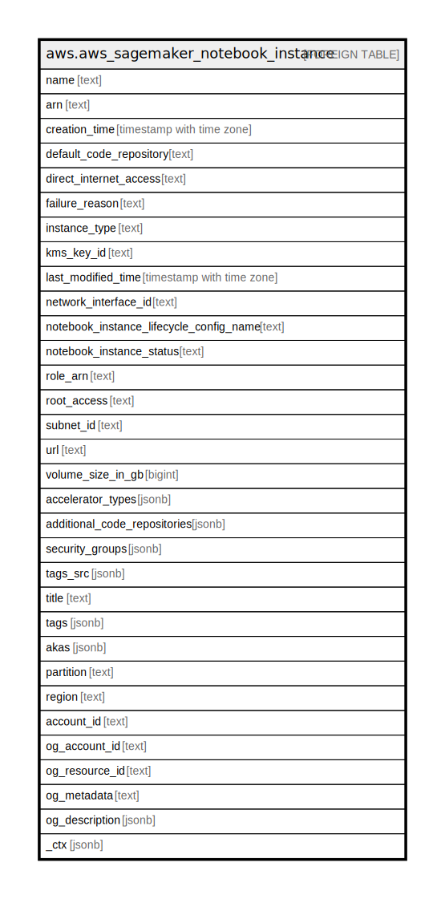

# aws.aws_sagemaker_notebook_instance

## Description

AWS Sagemaker Notebook Instance

## Columns

| Name | Type | Default | Nullable | Children | Parents | Comment |
| ---- | ---- | ------- | -------- | -------- | ------- | ------- |
| name | text |  | true |  |  | The name of the notebook instance. |
| arn | text |  | true |  |  | The Amazon Resource Name (ARN) of the notebook instance. |
| creation_time | timestamp with time zone |  | true |  |  | A timestamp that shows when the notebook instance was created. |
| default_code_repository | text |  | true |  |  | The Git repository associated with the notebook instance as its default code repository. |
| direct_internet_access | text |  | true |  |  | Describes whether Amazon SageMaker provides internet access to the notebook instance. |
| failure_reason | text |  | true |  |  | If status is Failed, the reason it failed. |
| instance_type | text |  | true |  |  | The type of ML compute instance that the notebook instance is running on. |
| kms_key_id | text |  | true |  |  | The AWS KMS key ID Amazon SageMaker uses to encrypt data when storing it on the ML storage volume attached to the instance. |
| last_modified_time | timestamp with time zone |  | true |  |  | A timestamp that shows when the notebook instance was last modified. |
| network_interface_id | text |  | true |  |  | The network interface IDs that Amazon SageMaker created at the time of creating the instance. |
| notebook_instance_lifecycle_config_name | text |  | true |  |  | The name of a notebook instance lifecycle configuration associated with this notebook instance. |
| notebook_instance_status | text |  | true |  |  | The status of the notebook instance. |
| role_arn | text |  | true |  |  | The Amazon Resource Name (ARN) of the IAM role associated with the instance. |
| root_access | text |  | true |  |  | Whether root access is enabled or disabled for users of the notebook instance.Lifecycle configurations need root access to be able to set up a notebook instance |
| subnet_id | text |  | true |  |  | The ID of the VPC subnet. |
| url | text |  | true |  |  | The URL that you use to connect to the Jupyter notebook that is running in your notebook instance. |
| volume_size_in_gb | bigint |  | true |  |  | The size, in GB, of the ML storage volume attached to the notebook instance. |
| accelerator_types | jsonb |  | true |  |  | The list of the Elastic Inference (EI) instance types associated with this notebook instance. |
| additional_code_repositories | jsonb |  | true |  |  | An array of up to three Git repositories associated with the notebook instance. |
| security_groups | jsonb |  | true |  |  | The IDs of the VPC security groups. |
| tags_src | jsonb |  | true |  |  | The list of tags for the notebook instance. |
| title | text |  | true |  |  | Title of the resource. |
| tags | jsonb |  | true |  |  | A map of tags for the resource. |
| akas | jsonb |  | true |  |  | Array of globally unique identifier strings (also known as) for the resource. |
| partition | text |  | true |  |  | The AWS partition in which the resource is located (aws, aws-cn, or aws-us-gov). |
| region | text |  | true |  |  | The AWS Region in which the resource is located. |
| account_id | text |  | true |  |  | The AWS Account ID in which the resource is located. |
| og_account_id | text |  | true |  |  | The Platform Account ID in which the resource is located. |
| og_resource_id | text |  | true |  |  | The unique ID of the resource in opengovernance. |
| og_metadata | text |  | true |  |  | Platform Metadata of the AWS resource. |
| og_description | jsonb |  | true |  |  | The full model description of the resource |
| _ctx | jsonb |  | true |  |  | Steampipe context in JSON form, e.g. connection_name. |

## Relations

---

> Generated by [tbls](https://github.com/k1LoW/tbls)
