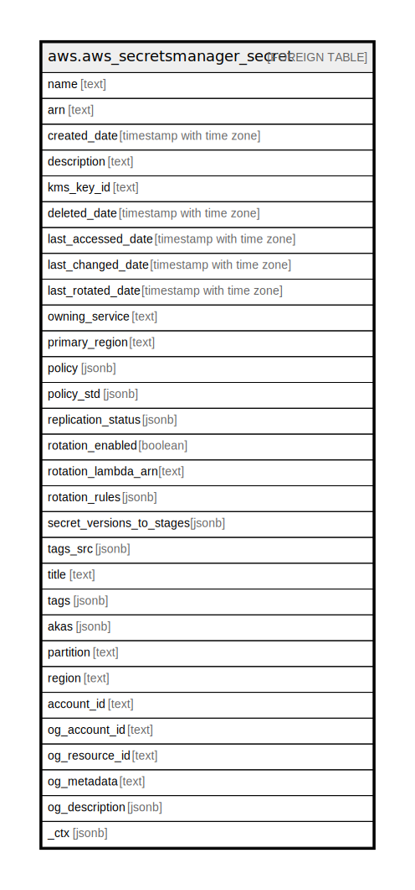

# aws.aws_secretsmanager_secret

## Description

AWS Secrets Manager Secret

## Columns

| Name | Type | Default | Nullable | Children | Parents | Comment |
| ---- | ---- | ------- | -------- | -------- | ------- | ------- |
| name | text |  | true |  |  | The friendly name of the secret. |
| arn | text |  | true |  |  | The Amazon Resource Name (ARN) of the secret. |
| created_date | timestamp with time zone |  | true |  |  | The date and time when a secret was created. |
| description | text |  | true |  |  | The user-provided description of the secret. |
| kms_key_id | text |  | true |  |  | The ARN or alias of the AWS KMS customer master key (CMK) used to encrypt the SecretString and SecretBinary fields in each version of the secret. |
| deleted_date | timestamp with time zone |  | true |  |  | The date and time the deletion of the secret occurred. |
| last_accessed_date | timestamp with time zone |  | true |  |  | The last date that this secret was accessed. |
| last_changed_date | timestamp with time zone |  | true |  |  | The last date and time that this secret was modified in any way. |
| last_rotated_date | timestamp with time zone |  | true |  |  | The most recent date and time that the Secrets Manager rotation process was successfully completed. |
| owning_service | text |  | true |  |  | Returns the name of the service that created the secret. |
| primary_region | text |  | true |  |  | The Region where Secrets Manager originated the secret. |
| policy | jsonb |  | true |  |  | A JSON-formatted string that describes the permissions that are associated with the attached secret. |
| policy_std | jsonb |  | true |  |  | Contains the permissions that are associated with the attached secret in a canonical form for easier searching. |
| replication_status | jsonb |  | true |  |  | Describes a list of replication status objects as InProgress, Failed or InSync. |
| rotation_enabled | boolean |  | true |  |  | Indicates whether automatic, scheduled rotation is enabled for this secret. |
| rotation_lambda_arn | text |  | true |  |  | The ARN of an AWS Lambda function invoked by Secrets Manager to rotate and expire the secret either automatically per the schedule or manually by a call to RotateSecret. |
| rotation_rules | jsonb |  | true |  |  | A structure that defines the rotation configuration for the secret. |
| secret_versions_to_stages | jsonb |  | true |  |  | A list of all of the currently assigned SecretVersionStage staging labels and the SecretVersionId attached to each one. |
| tags_src | jsonb |  | true |  |  | The list of user-defined tags associated with the secret. |
| title | text |  | true |  |  | Title of the resource. |
| tags | jsonb |  | true |  |  | A map of tags for the resource. |
| akas | jsonb |  | true |  |  | Array of globally unique identifier strings (also known as) for the resource. |
| partition | text |  | true |  |  | The AWS partition in which the resource is located (aws, aws-cn, or aws-us-gov). |
| region | text |  | true |  |  | The AWS Region in which the resource is located. |
| account_id | text |  | true |  |  | The AWS Account ID in which the resource is located. |
| og_account_id | text |  | true |  |  | The Platform Account ID in which the resource is located. |
| og_resource_id | text |  | true |  |  | The unique ID of the resource in opengovernance. |
| og_metadata | text |  | true |  |  | Platform Metadata of the AWS resource. |
| og_description | jsonb |  | true |  |  | The full model description of the resource |
| _ctx | jsonb |  | true |  |  | Steampipe context in JSON form, e.g. connection_name. |

## Relations

---

> Generated by [tbls](https://github.com/k1LoW/tbls)
