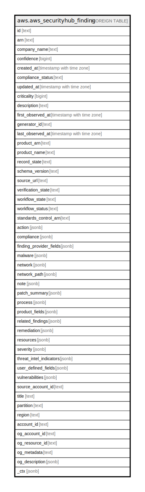

# aws.aws_securityhub_finding

## Description

AWS Security Hub Finding

## Columns

| Name | Type | Default | Nullable | Children | Parents | Comment |
| ---- | ---- | ------- | -------- | -------- | ------- | ------- |
| id | text |  | true |  |  | The security findings provider-specific identifier for a finding. |
| arn | text |  | true |  |  | The Amazon Resource Name (ARN) for the finding. |
| company_name | text |  | true |  |  | The name of the company for the product that generated the finding. |
| confidence | bigint |  | true |  |  | A finding's confidence. Confidence is defined as the likelihood that a finding accurately identifies the behavior or issue that it was intended to identify. |
| created_at | timestamp with time zone |  | true |  |  | Indicates when the security-findings provider created the potential security issue that a finding captured. |
| compliance_status | text |  | true |  |  | The result of a compliance standards check. |
| updated_at | timestamp with time zone |  | true |  |  | Indicates when the security-findings provider last updated the finding record. |
| criticality | bigint |  | true |  |  | The level of importance assigned to the resources associated with the finding. |
| description | text |  | true |  |  | A finding's description. |
| first_observed_at | timestamp with time zone |  | true |  |  | Indicates when the security-findings provider first observed the potential security issue that a finding captured. |
| generator_id | text |  | true |  |  | The identifier for the solution-specific component (a discrete unit of logic) that generated a finding. |
| last_observed_at | timestamp with time zone |  | true |  |  | Indicates when the security-findings provider most recently observed the potential security issue that a finding captured. |
| product_arn | text |  | true |  |  | The ARN generated by Security Hub that uniquely identifies a product that generates findings. |
| product_name | text |  | true |  |  | The name of the product that generated the finding. |
| record_state | text |  | true |  |  | The record state of a finding. |
| schema_version | text |  | true |  |  | The schema version that a finding is formatted for. |
| source_url | text |  | true |  |  | A URL that links to a page about the current finding in the security-findings provider's solution. |
| verification_state | text |  | true |  |  | Indicates the veracity of a finding. |
| workflow_state | text |  | true |  |  | [DEPRECATED] This column has been deprecated and will be removed in a future release. The workflow state of a finding. |
| workflow_status | text |  | true |  |  | The workflow status of a finding. Possible values are NEW, NOTIFIED, SUPPRESSED, RESOLVED. |
| standards_control_arn | text |  | true |  |  | The ARN of the security standard control. |
| action | jsonb |  | true |  |  | Provides details about an action that affects or that was taken on a resource. |
| compliance | jsonb |  | true |  |  | This data type is exclusive to findings that are generated as the result of a check run against a specific rule in a supported security standard, such as CIS Amazon Web Services Foundations. |
| finding_provider_fields | jsonb |  | true |  |  | In a BatchImportFindings request, finding providers use FindingProviderFields to provide and update their own values for confidence, criticality, related findings, severity, and types. |
| malware | jsonb |  | true |  |  | A list of malware related to a finding. |
| network | jsonb |  | true |  |  | The details of network-related information about a finding. |
| network_path | jsonb |  | true |  |  | Provides information about a network path that is relevant to a finding. Each entry under NetworkPath represents a component of that path. |
| note | jsonb |  | true |  |  | A user-defined note added to a finding. |
| patch_summary | jsonb |  | true |  |  | Provides an overview of the patch compliance status for an instance against a selected compliance standard. |
| process | jsonb |  | true |  |  | The details of process-related information about a finding. |
| product_fields | jsonb |  | true |  |  | A data type where security-findings providers can include additional solution-specific details that aren't part of the defined AwsSecurityFinding format. |
| related_findings | jsonb |  | true |  |  | A list of related findings. |
| remediation | jsonb |  | true |  |  | A data type that describes the remediation options for a finding. |
| resources | jsonb |  | true |  |  | A set of resource data types that describe the resources that the finding refers to. |
| severity | jsonb |  | true |  |  | A finding's severity. |
| threat_intel_indicators | jsonb |  | true |  |  | Threat intelligence details related to a finding. |
| user_defined_fields | jsonb |  | true |  |  | A list of name/value string pairs associated with the finding. |
| vulnerabilities | jsonb |  | true |  |  | Provides a list of vulnerabilities associated with the findings. |
| source_account_id | text |  | true |  |  | The account id where the affected resource lives. |
| title | text |  | true |  |  | A finding's title. |
| partition | text |  | true |  |  | The AWS partition in which the resource is located (aws, aws-cn, or aws-us-gov). |
| region | text |  | true |  |  | The AWS Region in which the resource is located. |
| account_id | text |  | true |  |  | The AWS Account ID in which the resource is located. |
| og_account_id | text |  | true |  |  | The Platform Account ID in which the resource is located. |
| og_resource_id | text |  | true |  |  | The unique ID of the resource in opengovernance. |
| og_metadata | text |  | true |  |  | Platform Metadata of the AWS resource. |
| og_description | jsonb |  | true |  |  | The full model description of the resource |
| _ctx | jsonb |  | true |  |  | Steampipe context in JSON form, e.g. connection_name. |

## Relations

---

> Generated by [tbls](https://github.com/k1LoW/tbls)
