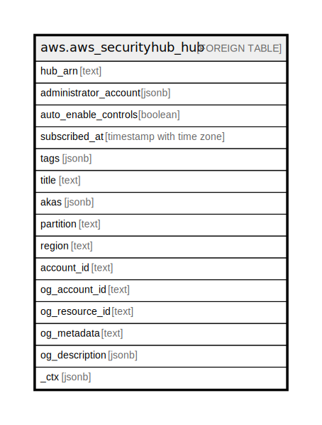

# aws.aws_securityhub_hub

## Description

AWS Security Hub

## Columns

| Name | Type | Default | Nullable | Children | Parents | Comment |
| ---- | ---- | ------- | -------- | -------- | ------- | ------- |
| hub_arn | text |  | true |  |  | The ARN of the Hub resource that was retrieved. |
| administrator_account | jsonb |  | true |  |  | Provides the details for the Security Hub administrator account for the current member account. |
| auto_enable_controls | boolean |  | true |  |  | Whether to automatically enable new controls when they are added to standards that are enabled. |
| subscribed_at | timestamp with time zone |  | true |  |  | The date and time when Security Hub was enabled in the account. |
| tags | jsonb |  | true |  |  | A map of tags for the resource. |
| title | text |  | true |  |  | The title of hub. This is a constant value 'default' |
| akas | jsonb |  | true |  |  | Array of globally unique identifier strings (also known as) for the resource. |
| partition | text |  | true |  |  | The AWS partition in which the resource is located (aws, aws-cn, or aws-us-gov). |
| region | text |  | true |  |  | The AWS Region in which the resource is located. |
| account_id | text |  | true |  |  | The AWS Account ID in which the resource is located. |
| og_account_id | text |  | true |  |  | The Platform Account ID in which the resource is located. |
| og_resource_id | text |  | true |  |  | The unique ID of the resource in opengovernance. |
| og_metadata | text |  | true |  |  | Platform Metadata of the AWS resource. |
| og_description | jsonb |  | true |  |  | The full model description of the resource |
| _ctx | jsonb |  | true |  |  | Steampipe context in JSON form, e.g. connection_name. |

## Relations

---

> Generated by [tbls](https://github.com/k1LoW/tbls)
