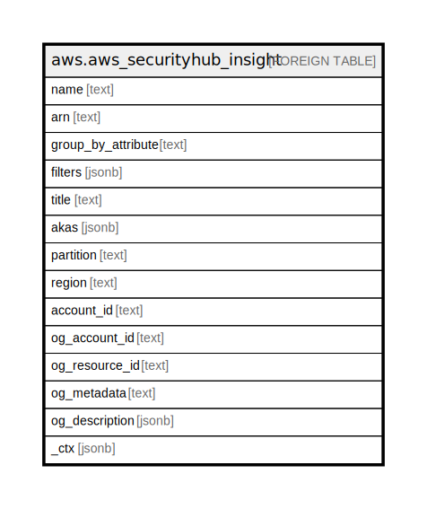

# aws.aws_securityhub_insight

## Description

AWS Securityhub Insight

## Columns

| Name | Type | Default | Nullable | Children | Parents | Comment |
| ---- | ---- | ------- | -------- | -------- | ------- | ------- |
| name | text |  | true |  |  | The name of a Security Hub insight. |
| arn | text |  | true |  |  | The ARN of a Security Hub insight. |
| group_by_attribute | text |  | true |  |  | The grouping attribute for the insight's findings. Indicates how to group the matching findings,and identifies the type of item that the insight applies to. For example, if an insight is grouped by resource identifier, then the insight produces a list of resource identifiers. |
| filters | jsonb |  | true |  |  | One or more attributes used to filter the findings included in the insight. The insight only includes findings that match the criteria defined in the filters. |
| title | text |  | true |  |  | Title of the resource. |
| akas | jsonb |  | true |  |  | Array of globally unique identifier strings (also known as) for the resource. |
| partition | text |  | true |  |  | The AWS partition in which the resource is located (aws, aws-cn, or aws-us-gov). |
| region | text |  | true |  |  | The AWS Region in which the resource is located. |
| account_id | text |  | true |  |  | The AWS Account ID in which the resource is located. |
| og_account_id | text |  | true |  |  | The Platform Account ID in which the resource is located. |
| og_resource_id | text |  | true |  |  | The unique ID of the resource in opengovernance. |
| og_metadata | text |  | true |  |  | Platform Metadata of the AWS resource. |
| og_description | jsonb |  | true |  |  | The full model description of the resource |
| _ctx | jsonb |  | true |  |  | Steampipe context in JSON form, e.g. connection_name. |

## Relations

---

> Generated by [tbls](https://github.com/k1LoW/tbls)
