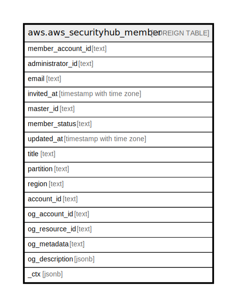

# aws.aws_securityhub_member

## Description

AWS Securityhub Member

## Columns

| Name | Type | Default | Nullable | Children | Parents | Comment |
| ---- | ---- | ------- | -------- | -------- | ------- | ------- |
| member_account_id | text |  | true |  |  | The Amazon Web Services account ID of the member account. |
| administrator_id | text |  | true |  |  | The Amazon Web Services account ID of the Security Hub administrator account associated with this member account. |
| email | text |  | true |  |  | The email address of the member account. |
| invited_at | timestamp with time zone |  | true |  |  | A timestamp for the date and time when the invitation was sent to the member account. |
| master_id | text |  | true |  |  | The Amazon Web Services account ID of the Security Hub administrator account associated with this member account. |
| member_status | text |  | true |  |  | The status of the relationship between the member account and its administrator account. |
| updated_at | timestamp with time zone |  | true |  |  | The timestamp for the date and time when the member account was updated. |
| title | text |  | true |  |  | Title of the resource. |
| partition | text |  | true |  |  | The AWS partition in which the resource is located (aws, aws-cn, or aws-us-gov). |
| region | text |  | true |  |  | The AWS Region in which the resource is located. |
| account_id | text |  | true |  |  | The AWS Account ID in which the resource is located. |
| og_account_id | text |  | true |  |  | The Platform Account ID in which the resource is located. |
| og_resource_id | text |  | true |  |  | The unique ID of the resource in opengovernance. |
| og_metadata | text |  | true |  |  | Platform Metadata of the AWS resource. |
| og_description | jsonb |  | true |  |  | The full model description of the resource |
| _ctx | jsonb |  | true |  |  | Steampipe context in JSON form, e.g. connection_name. |

## Relations

---

> Generated by [tbls](https://github.com/k1LoW/tbls)
