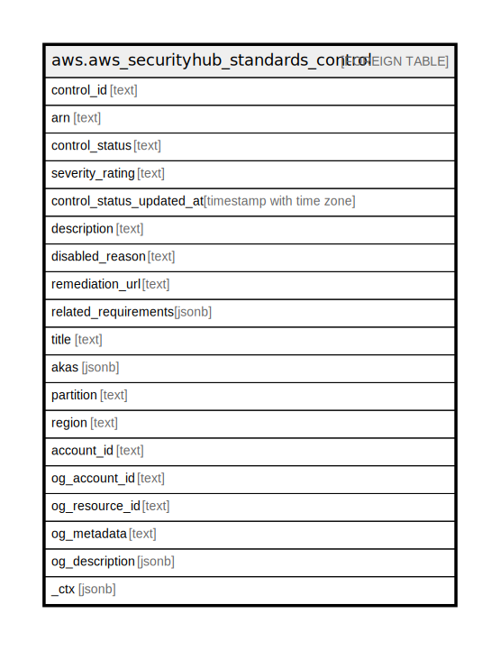

# aws.aws_securityhub_standards_control

## Description

AWS Security Hub Standards Control

## Columns

| Name | Type | Default | Nullable | Children | Parents | Comment |
| ---- | ---- | ------- | -------- | -------- | ------- | ------- |
| control_id | text |  | true |  |  | The identifier of the security standard control. |
| arn | text |  | true |  |  | The ARN of the security standard control. |
| control_status | text |  | true |  |  | The current status of the security standard control. Indicates whether the control is enabled or disabled. Security Hub does not check against disabled controls. |
| severity_rating | text |  | true |  |  | The severity of findings generated from this security standard control. |
| control_status_updated_at | timestamp with time zone |  | true |  |  | The date and time that the status of the security standard control was most recently updated. |
| description | text |  | true |  |  | The longer description of the security standard control. |
| disabled_reason | text |  | true |  |  | The reason provided for the most recent change in status for the control. |
| remediation_url | text |  | true |  |  | A link to remediation information for the control in the Security Hub user documentation. |
| related_requirements | jsonb |  | true |  |  | The list of requirements that are related to this control. |
| title | text |  | true |  |  | Title of the resource. |
| akas | jsonb |  | true |  |  | Array of globally unique identifier strings (also known as) for the resource. |
| partition | text |  | true |  |  | The AWS partition in which the resource is located (aws, aws-cn, or aws-us-gov). |
| region | text |  | true |  |  | The AWS Region in which the resource is located. |
| account_id | text |  | true |  |  | The AWS Account ID in which the resource is located. |
| og_account_id | text |  | true |  |  | The Platform Account ID in which the resource is located. |
| og_resource_id | text |  | true |  |  | The unique ID of the resource in opengovernance. |
| og_metadata | text |  | true |  |  | Platform Metadata of the AWS resource. |
| og_description | jsonb |  | true |  |  | The full model description of the resource |
| _ctx | jsonb |  | true |  |  | Steampipe context in JSON form, e.g. connection_name. |

## Relations

---

> Generated by [tbls](https://github.com/k1LoW/tbls)
