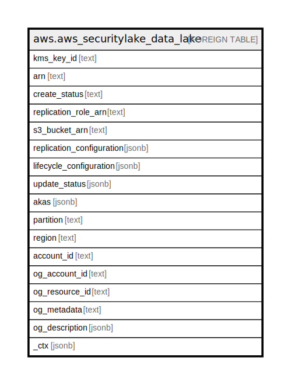

# aws.aws_securitylake_data_lake

## Description

AWS Security Lake Data Lake

## Columns

| Name | Type | Default | Nullable | Children | Parents | Comment |
| ---- | ---- | ------- | -------- | -------- | ------- | ------- |
| kms_key_id | text |  | true |  |  | The id of KMS encryption key used by Amazon Security Lake to encrypt the Security Lake object. |
| arn | text |  | true |  |  | The Amazon Resource Name (ARN) created by you to provide to the subscriber. |
| create_status | text |  | true |  |  | Retrieves the status of the configuration operation for an account in Amazon Security Lake. |
| replication_role_arn | text |  | true |  |  | This parameter uses the IAM role created by you that is managed by Security Lake, to ensure the replication setting is correct. |
| s3_bucket_arn | text |  | true |  |  | Amazon Resource Names (ARNs) uniquely identify Amazon Web Services resources. |
| replication_configuration | jsonb |  | true |  |  | Provides replication details of Amazon Security Lake object. |
| lifecycle_configuration | jsonb |  | true |  |  | Provides lifecycle details of Amazon Security Lake object. |
| update_status | jsonb |  | true |  |  | The status of the last UpdateDataLake or DeleteDataLake API request. |
| akas | jsonb |  | true |  |  | Array of globally unique identifier strings (also known as) for the resource. |
| partition | text |  | true |  |  | The AWS partition in which the resource is located (aws, aws-cn, or aws-us-gov). |
| region | text |  | true |  |  | The AWS Region in which the resource is located. |
| account_id | text |  | true |  |  | The AWS Account ID in which the resource is located. |
| og_account_id | text |  | true |  |  | The Platform Account ID in which the resource is located. |
| og_resource_id | text |  | true |  |  | The unique ID of the resource in opengovernance. |
| og_metadata | text |  | true |  |  | Platform Metadata of the AWS resource. |
| og_description | jsonb |  | true |  |  | The full model description of the resource |
| _ctx | jsonb |  | true |  |  | Steampipe context in JSON form, e.g. connection_name. |

## Relations

---

> Generated by [tbls](https://github.com/k1LoW/tbls)
