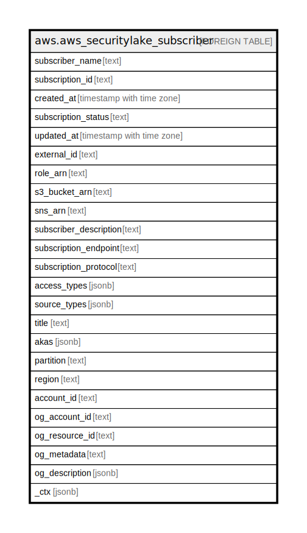

# aws.aws_securitylake_subscriber

## Description

AWS Security Lake Subscriber

## Columns

| Name | Type | Default | Nullable | Children | Parents | Comment |
| ---- | ---- | ------- | -------- | -------- | ------- | ------- |
| subscriber_name | text |  | true |  |  | The name of your Amazon Security Lake subscriber account. |
| subscription_id | text |  | true |  |  | The subscription ID of the Amazon Security Lake subscriber account. |
| created_at | timestamp with time zone |  | true |  |  | The date and time when the subscription was created. |
| subscription_status | text |  | true |  |  | Subscription status of the Amazon Security Lake subscriber account. |
| updated_at | timestamp with time zone |  | true |  |  | The date and time when the subscription was updated. |
| external_id | text |  | true |  |  | The external ID of the subscriber. |
| role_arn | text |  | true |  |  | The Amazon Resource Name (ARN) specifying the role of the subscriber. |
| s3_bucket_arn | text |  | true |  |  | The Amazon Resource Name (ARN) for the Amazon S3 bucket. |
| sns_arn | text |  | true |  |  | The Amazon Resource Name (ARN) for the Amazon Simple Notification Service. |
| subscriber_description | text |  | true |  |  | The subscriber descriptions for a subscriber account. |
| subscription_endpoint | text |  | true |  |  | The subscription endpoint to which exception messages are posted. |
| subscription_protocol | text |  | true |  |  | The subscription protocol to which exception messages are posted. |
| access_types | jsonb |  | true |  |  | You can choose to notify subscribers of new objects with an Amazon Simple Queue Service (Amazon SQS) queue or through messaging to an HTTPS endpoint provided by the subscriber. Subscribers can consume data by directly querying Lake Formation tables in your S3 bucket via services like Amazon Athena. This subscription type is defined as LAKEFORMATION. |
| source_types | jsonb |  | true |  |  | Amazon Security Lake supports logs and events collection for the natively-supported Amazon Web Services services. |
| title | text |  | true |  |  | Title of the resource. |
| akas | jsonb |  | true |  |  | Array of globally unique identifier strings (also known as) for the resource. |
| partition | text |  | true |  |  | The AWS partition in which the resource is located (aws, aws-cn, or aws-us-gov). |
| region | text |  | true |  |  | The AWS Region in which the resource is located. |
| account_id | text |  | true |  |  | The AWS Account ID in which the resource is located. |
| og_account_id | text |  | true |  |  | The Platform Account ID in which the resource is located. |
| og_resource_id | text |  | true |  |  | The unique ID of the resource in opengovernance. |
| og_metadata | text |  | true |  |  | Platform Metadata of the AWS resource. |
| og_description | jsonb |  | true |  |  | The full model description of the resource |
| _ctx | jsonb |  | true |  |  | Steampipe context in JSON form, e.g. connection_name. |

## Relations

---

> Generated by [tbls](https://github.com/k1LoW/tbls)
