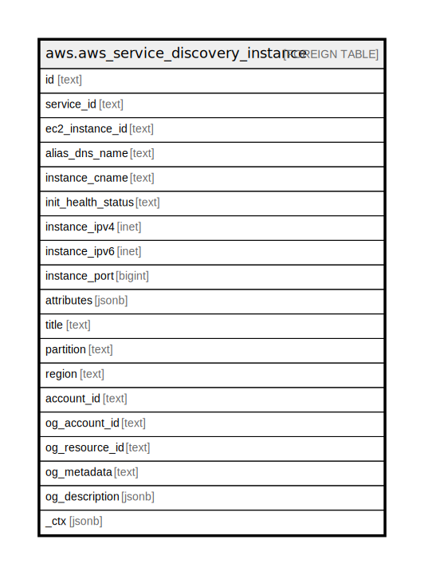

# aws.aws_service_discovery_instance

## Description

AWS Service Discovery Instance

## Columns

| Name | Type | Default | Nullable | Children | Parents | Comment |
| ---- | ---- | ------- | -------- | -------- | ------- | ------- |
| id | text |  | true |  |  | The ID of the instance. |
| service_id | text |  | true |  |  | The ID of the service. |
| ec2_instance_id | text |  | true |  |  | The Amazon EC2 instance ID for the instance. When the AWS_EC2_INSTANCE_ID attribute is specified, then the AWS_INSTANCE_IPV4 attribute contains the primary private IPv4 address. |
| alias_dns_name | text |  | true |  |  | For an alias record that routes traffic to an Elastic Load Balancing load balancer, the DNS name that's associated with the load balancer. |
| instance_cname | text |  | true |  |  | A CNAME record, the domain name that Route 53 returns in response to DNS queries (for example, example.com ). |
| init_health_status | text |  | true |  |  | If the service configuration includes HealthCheckCustomConfig, you can optionally use AWS_INIT_HEALTH_STATUS to specify the initial status of the custom health check, HEALTHY or UNHEALTHY. If you don't specify a value for AWS_INIT_HEALTH_STATUS, the initial status is HEALTHY. |
| instance_ipv4 | inet |  | true |  |  | For an A record, the IPv4 address that Route 53 returns in response to DNS queries. |
| instance_ipv6 | inet |  | true |  |  | For an AAAA record, the IPv6 address that Route 53 returns in response to DNS queries. |
| instance_port | bigint |  | true |  |  | For an SRV record, the value that Route 53 returns for the port. In addition, if the service includes HealthCheckConfig, the port on the endpoint that Route 53 sends requests to. |
| attributes | jsonb |  | true |  |  | Attributes of the instance. |
| title | text |  | true |  |  | Title of the resource. |
| partition | text |  | true |  |  | The AWS partition in which the resource is located (aws, aws-cn, or aws-us-gov). |
| region | text |  | true |  |  | The AWS Region in which the resource is located. |
| account_id | text |  | true |  |  | The AWS Account ID in which the resource is located. |
| og_account_id | text |  | true |  |  | The Platform Account ID in which the resource is located. |
| og_resource_id | text |  | true |  |  | The unique ID of the resource in opengovernance. |
| og_metadata | text |  | true |  |  | Platform Metadata of the AWS resource. |
| og_description | jsonb |  | true |  |  | The full model description of the resource |
| _ctx | jsonb |  | true |  |  | Steampipe context in JSON form, e.g. connection_name. |

## Relations

---

> Generated by [tbls](https://github.com/k1LoW/tbls)
