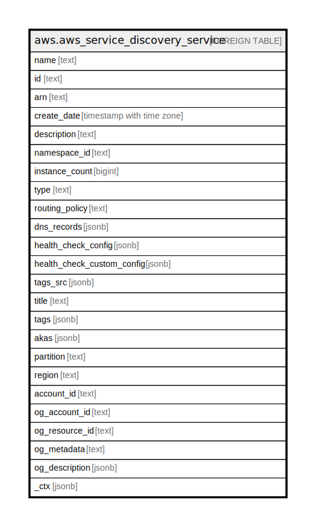

# aws.aws_service_discovery_service

## Description

AWS Service Discovery Service

## Columns

| Name | Type | Default | Nullable | Children | Parents | Comment |
| ---- | ---- | ------- | -------- | -------- | ------- | ------- |
| name | text |  | true |  |  | The name of the service. |
| id | text |  | true |  |  | The ID that Cloud Map assigned to the service when you created it. |
| arn | text |  | true |  |  | The Amazon Resource Name (ARN) that Cloud Map assigns to the service when you create it. |
| create_date | timestamp with time zone |  | true |  |  | The date and time that the service was created. |
| description | text |  | true |  |  | A description for the service. |
| namespace_id | text |  | true |  |  | The ID of the namespace. |
| instance_count | bigint |  | true |  |  | The number of instances that are currently associated with the service. |
| type | text |  | true |  |  | Describes the systems that can be used to discover the service instances. DNS_HTTP The service instances can be discovered using either DNS queries or the DiscoverInstances API operation. HTTP The service instances can only be discovered using the DiscoverInstances API operation. DNS Reserved. |
| routing_policy | text |  | true |  |  | The routing policy that you want to apply to all Route 53 DNS records that Cloud Map creates when you register an instance and specify this service. |
| dns_records | jsonb |  | true |  |  | An array that contains one DnsRecord object for each Route 53 DNS record that you want Cloud Map to create when you register an instance. |
| health_check_config | jsonb |  | true |  |  | Public DNS and HTTP namespaces only. Settings for an optional health check. If you specify settings for a health check, Cloud Map associates the health check with the records that you specify in DnsConfig. |
| health_check_custom_config | jsonb |  | true |  |  | Information about an optional custom health check. |
| tags_src | jsonb |  | true |  |  | Information about the tags associated with the namespace. |
| title | text |  | true |  |  | Title of the resource. |
| tags | jsonb |  | true |  |  | A map of tags for the resource. |
| akas | jsonb |  | true |  |  | Array of globally unique identifier strings (also known as) for the resource. |
| partition | text |  | true |  |  | The AWS partition in which the resource is located (aws, aws-cn, or aws-us-gov). |
| region | text |  | true |  |  | The AWS Region in which the resource is located. |
| account_id | text |  | true |  |  | The AWS Account ID in which the resource is located. |
| og_account_id | text |  | true |  |  | The Platform Account ID in which the resource is located. |
| og_resource_id | text |  | true |  |  | The unique ID of the resource in opengovernance. |
| og_metadata | text |  | true |  |  | Platform Metadata of the AWS resource. |
| og_description | jsonb |  | true |  |  | The full model description of the resource |
| _ctx | jsonb |  | true |  |  | Steampipe context in JSON form, e.g. connection_name. |

## Relations

---

> Generated by [tbls](https://github.com/k1LoW/tbls)
