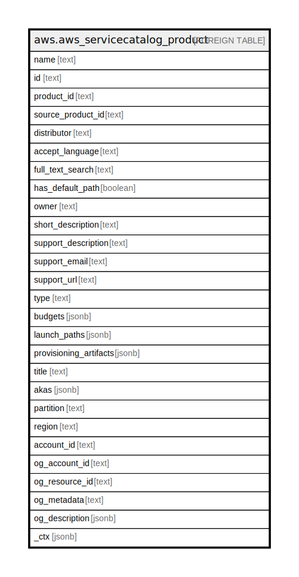

# aws.aws_servicecatalog_product

## Description

AWS Service Catalog Product

## Columns

| Name | Type | Default | Nullable | Children | Parents | Comment |
| ---- | ---- | ------- | -------- | -------- | ------- | ------- |
| name | text |  | true |  |  | The name of the product. |
| id | text |  | true |  |  | The product view identifier. |
| product_id | text |  | true |  |  | The product identifier. |
| source_product_id | text |  | true |  |  | The source product identifier. |
| distributor | text |  | true |  |  | The distributor of the product. Contact the product administrator for the significance of this value. |
| accept_language | text |  | true |  |  | The language code. |
| full_text_search | text |  | true |  |  | The full text for the product. |
| has_default_path | boolean |  | true |  |  | Indicates whether the product has a default path. If the product does not have a default path, call ListLaunchPaths to disambiguate between paths. |
| owner | text |  | true |  |  | The owner of the product. Contact the product administrator for the significance of this value. |
| short_description | text |  | true |  |  | Short description of the product. |
| support_description | text |  | true |  |  | The description of the support for this product. |
| support_email | text |  | true |  |  | The email contact information to obtain support for this product. |
| support_url | text |  | true |  |  | The URL information to obtain support for this product. |
| type | text |  | true |  |  | The product type. Contact the product administrator for the significance of this value. If this value is MARKETPLACE, the product was created by Amazon Web Services Marketplace. |
| budgets | jsonb |  | true |  |  | Information about the associated budgets. |
| launch_paths | jsonb |  | true |  |  | Information about the associated launch paths. |
| provisioning_artifacts | jsonb |  | true |  |  | Information about the provisioning artifacts for the specified product. |
| title | text |  | true |  |  | Title of the resource. |
| akas | jsonb |  | true |  |  | Array of globally unique identifier strings (also known as) for the resource. |
| partition | text |  | true |  |  | The AWS partition in which the resource is located (aws, aws-cn, or aws-us-gov). |
| region | text |  | true |  |  | The AWS Region in which the resource is located. |
| account_id | text |  | true |  |  | The AWS Account ID in which the resource is located. |
| og_account_id | text |  | true |  |  | The Platform Account ID in which the resource is located. |
| og_resource_id | text |  | true |  |  | The unique ID of the resource in opengovernance. |
| og_metadata | text |  | true |  |  | Platform Metadata of the AWS resource. |
| og_description | jsonb |  | true |  |  | The full model description of the resource |
| _ctx | jsonb |  | true |  |  | Steampipe context in JSON form, e.g. connection_name. |

## Relations

---

> Generated by [tbls](https://github.com/k1LoW/tbls)
