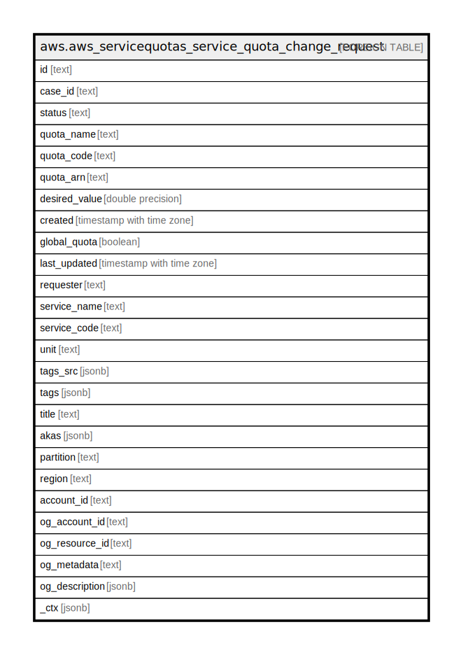

# aws.aws_servicequotas_service_quota_change_request

## Description

AWS ServiceQuotas Service Quota Change Request

## Columns

| Name | Type | Default | Nullable | Children | Parents | Comment |
| ---- | ---- | ------- | -------- | -------- | ------- | ------- |
| id | text |  | true |  |  | The unique identifier. |
| case_id | text |  | true |  |  | The case ID. |
| status | text |  | true |  |  | The state of the quota increase request. |
| quota_name | text |  | true |  |  | The quota name. |
| quota_code | text |  | true |  |  | The quota code. |
| quota_arn | text |  | true |  |  | The arn of the service quota. |
| desired_value | double precision |  | true |  |  | The increased value for the quota. |
| created | timestamp with time zone |  | true |  |  | The date and time when the quota increase request was received and the case ID was created. |
| global_quota | boolean |  | true |  |  | Indicates whether the quota is global. |
| last_updated | timestamp with time zone |  | true |  |  | The date and time of the most recent change. |
| requester | text |  | true |  |  | The IAM identity of the requester. |
| service_name | text |  | true |  |  | The service name. |
| service_code | text |  | true |  |  | The service identifier. |
| unit | text |  | true |  |  | The unit of measurement. |
| tags_src | jsonb |  | true |  |  | The list of tags associated with the change request. |
| tags | jsonb |  | true |  |  | A map of tags for the resource. |
| title | text |  | true |  |  | Title of the resource. |
| akas | jsonb |  | true |  |  | Array of globally unique identifier strings (also known as) for the resource. |
| partition | text |  | true |  |  | The AWS partition in which the resource is located (aws, aws-cn, or aws-us-gov). |
| region | text |  | true |  |  | The AWS Region in which the resource is located. |
| account_id | text |  | true |  |  | The AWS Account ID in which the resource is located. |
| og_account_id | text |  | true |  |  | The Platform Account ID in which the resource is located. |
| og_resource_id | text |  | true |  |  | The unique ID of the resource in opengovernance. |
| og_metadata | text |  | true |  |  | Platform Metadata of the AWS resource. |
| og_description | jsonb |  | true |  |  | The full model description of the resource |
| _ctx | jsonb |  | true |  |  | Steampipe context in JSON form, e.g. connection_name. |

## Relations

---

> Generated by [tbls](https://github.com/k1LoW/tbls)
