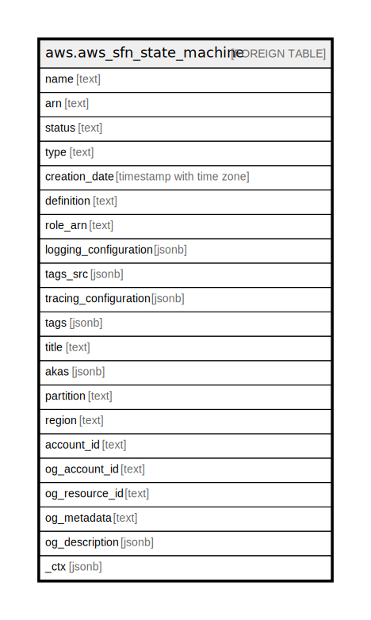

# aws.aws_sfn_state_machine

## Description

AWS Step Functions State Machine

## Columns

| Name | Type | Default | Nullable | Children | Parents | Comment |
| ---- | ---- | ------- | -------- | -------- | ------- | ------- |
| name | text |  | true |  |  | The name of the state machine. |
| arn | text |  | true |  |  | The Amazon Resource Name (ARN) that identifies the state machine. |
| status | text |  | true |  |  | The current status of the state machine. |
| type | text |  | true |  |  | The type of the state machine. |
| creation_date | timestamp with time zone |  | true |  |  | The date the state machine is created. |
| definition | text |  | true |  |  | The Amazon States Language definition of the state machine. |
| role_arn | text |  | true |  |  | The Amazon Resource Name (ARN) of the IAM role used when creating this state machine. |
| logging_configuration | jsonb |  | true |  |  | The LoggingConfiguration data type is used to set CloudWatch Logs options. |
| tags_src | jsonb |  | true |  |  | The list of tags associated with the state machine. |
| tracing_configuration | jsonb |  | true |  |  | Selects whether AWS X-Ray tracing is enabled. |
| tags | jsonb |  | true |  |  | A map of tags for the resource. |
| title | text |  | true |  |  | Title of the resource. |
| akas | jsonb |  | true |  |  | Array of globally unique identifier strings (also known as) for the resource. |
| partition | text |  | true |  |  | The AWS partition in which the resource is located (aws, aws-cn, or aws-us-gov). |
| region | text |  | true |  |  | The AWS Region in which the resource is located. |
| account_id | text |  | true |  |  | The AWS Account ID in which the resource is located. |
| og_account_id | text |  | true |  |  | The Platform Account ID in which the resource is located. |
| og_resource_id | text |  | true |  |  | The unique ID of the resource in opengovernance. |
| og_metadata | text |  | true |  |  | Platform Metadata of the AWS resource. |
| og_description | jsonb |  | true |  |  | The full model description of the resource |
| _ctx | jsonb |  | true |  |  | Steampipe context in JSON form, e.g. connection_name. |

## Relations

---

> Generated by [tbls](https://github.com/k1LoW/tbls)
