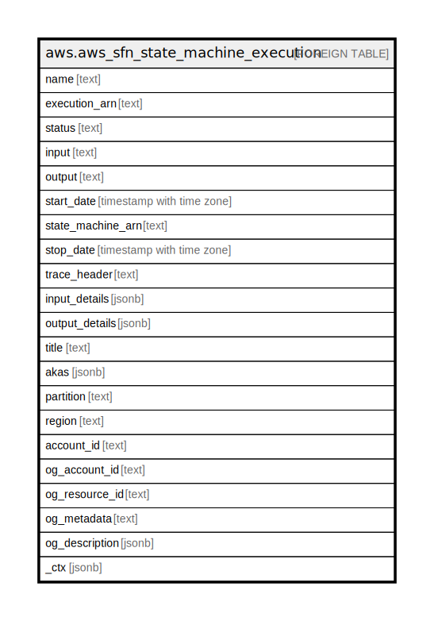

# aws.aws_sfn_state_machine_execution

## Description

AWS Step Functions State Machine Execution

## Columns

| Name | Type | Default | Nullable | Children | Parents | Comment |
| ---- | ---- | ------- | -------- | -------- | ------- | ------- |
| name | text |  | true |  |  | The name of the execution. |
| execution_arn | text |  | true |  |  | The Amazon Resource Name (ARN) that identifies the execution. |
| status | text |  | true |  |  | The current status of the execution. |
| input | text |  | true |  |  | The string that contains the JSON input data of the execution. |
| output | text |  | true |  |  | The JSON output data of the execution. |
| start_date | timestamp with time zone |  | true |  |  | The date the execution started. |
| state_machine_arn | text |  | true |  |  | The Amazon Resource Name (ARN) of the executed state machine. |
| stop_date | timestamp with time zone |  | true |  |  | If the execution already ended, the date the execution stopped. |
| trace_header | text |  | true |  |  | The AWS X-Ray trace header that was passed to the execution. |
| input_details | jsonb |  | true |  |  | Provides details about execution input or output. |
| output_details | jsonb |  | true |  |  | Provides details about execution input or output. |
| title | text |  | true |  |  | Title of the resource. |
| akas | jsonb |  | true |  |  | Array of globally unique identifier strings (also known as) for the resource. |
| partition | text |  | true |  |  | The AWS partition in which the resource is located (aws, aws-cn, or aws-us-gov). |
| region | text |  | true |  |  | The AWS Region in which the resource is located. |
| account_id | text |  | true |  |  | The AWS Account ID in which the resource is located. |
| og_account_id | text |  | true |  |  | The Platform Account ID in which the resource is located. |
| og_resource_id | text |  | true |  |  | The unique ID of the resource in opengovernance. |
| og_metadata | text |  | true |  |  | Platform Metadata of the AWS resource. |
| og_description | jsonb |  | true |  |  | The full model description of the resource |
| _ctx | jsonb |  | true |  |  | Steampipe context in JSON form, e.g. connection_name. |

## Relations

---

> Generated by [tbls](https://github.com/k1LoW/tbls)
