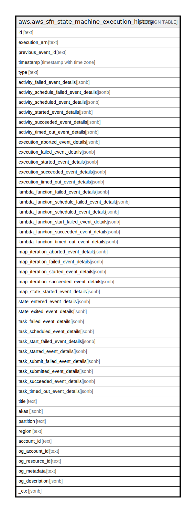

# aws.aws_sfn_state_machine_execution_history

## Description

AWS Step Functions State Machine Execution History

## Columns

| Name | Type | Default | Nullable | Children | Parents | Comment |
| ---- | ---- | ------- | -------- | -------- | ------- | ------- |
| id | text |  | true |  |  | The id of the event. |
| execution_arn | text |  | true |  |  | The Amazon Resource Name (ARN) that identifies the execution. |
| previous_event_id | text |  | true |  |  | The id of the previous event. |
| timestamp | timestamp with time zone |  | true |  |  | The date and time the event occurred. |
| type | text |  | true |  |  | The type of the event. |
| activity_failed_event_details | jsonb |  | true |  |  | Contains details about an activity that failed during an execution. |
| activity_schedule_failed_event_details | jsonb |  | true |  |  | Contains details about an activity schedule event that failed during an execution. |
| activity_scheduled_event_details | jsonb |  | true |  |  | Contains details about an activity scheduled during an execution. |
| activity_started_event_details | jsonb |  | true |  |  | Contains details about the start of an activity during an execution. |
| activity_succeeded_event_details | jsonb |  | true |  |  | Contains details about an activity that successfully terminated during an execution. |
| activity_timed_out_event_details | jsonb |  | true |  |  | Contains details about an activity timeout that occurred during an execution. |
| execution_aborted_event_details | jsonb |  | true |  |  | Contains details about an abort of an execution. |
| execution_failed_event_details | jsonb |  | true |  |  | Contains details about an execution failure event. |
| execution_started_event_details | jsonb |  | true |  |  | Contains details about the start of the execution. |
| execution_succeeded_event_details | jsonb |  | true |  |  | Contains details about the successful termination of the execution. |
| execution_timed_out_event_details | jsonb |  | true |  |  | Contains details about the execution timeout that occurred during the execution. |
| lambda_function_failed_event_details | jsonb |  | true |  |  | Contains details about a lambda function that failed during an execution. |
| lambda_function_schedule_failed_event_details | jsonb |  | true |  |  | Contains details about a failed lambda function schedule event that occurred during an execution. |
| lambda_function_scheduled_event_details | jsonb |  | true |  |  | Contains details about a lambda function scheduled during an execution. |
| lambda_function_start_failed_event_details | jsonb |  | true |  |  | Contains details about a lambda function that failed to start during an execution. |
| lambda_function_succeeded_event_details | jsonb |  | true |  |  | Contains details about a lambda function that terminated successfully during an execution. |
| lambda_function_timed_out_event_details | jsonb |  | true |  |  | Contains details about a lambda function timeout that occurred during an execution. |
| map_iteration_aborted_event_details | jsonb |  | true |  |  | Contains details about an iteration of a Map state that was aborted. |
| map_iteration_failed_event_details | jsonb |  | true |  |  | Contains details about an iteration of a Map state that failed. |
| map_iteration_started_event_details | jsonb |  | true |  |  | Contains details about an iteration of a Map state that was started. |
| map_iteration_succeeded_event_details | jsonb |  | true |  |  | Contains details about an iteration of a Map state that succeeded. |
| map_state_started_event_details | jsonb |  | true |  |  | Contains details about Map state that was started. |
| state_entered_event_details | jsonb |  | true |  |  | Contains details about a state entered during an execution. |
| state_exited_event_details | jsonb |  | true |  |  | Contains details about an exit from a state during an execution. |
| task_failed_event_details | jsonb |  | true |  |  | Contains details about the failure of a task. |
| task_scheduled_event_details | jsonb |  | true |  |  | Contains details about a task that was scheduled. |
| task_start_failed_event_details | jsonb |  | true |  |  | Contains details about a task that failed to start. |
| task_started_event_details | jsonb |  | true |  |  | Contains details about a task that was started. |
| task_submit_failed_event_details | jsonb |  | true |  |  | Contains details about a task that where the submit failed. |
| task_submitted_event_details | jsonb |  | true |  |  | Contains details about a submitted task. |
| task_succeeded_event_details | jsonb |  | true |  |  | Contains details about a task that succeeded. |
| task_timed_out_event_details | jsonb |  | true |  |  | Contains details about a task that timed out. |
| title | text |  | true |  |  | Title of the resource. |
| akas | jsonb |  | true |  |  | Array of globally unique identifier strings (also known as) for the resource. |
| partition | text |  | true |  |  | The AWS partition in which the resource is located (aws, aws-cn, or aws-us-gov). |
| region | text |  | true |  |  | The AWS Region in which the resource is located. |
| account_id | text |  | true |  |  | The AWS Account ID in which the resource is located. |
| og_account_id | text |  | true |  |  | The Platform Account ID in which the resource is located. |
| og_resource_id | text |  | true |  |  | The unique ID of the resource in opengovernance. |
| og_metadata | text |  | true |  |  | Platform Metadata of the AWS resource. |
| og_description | jsonb |  | true |  |  | The full model description of the resource |
| _ctx | jsonb |  | true |  |  | Steampipe context in JSON form, e.g. connection_name. |

## Relations

---

> Generated by [tbls](https://github.com/k1LoW/tbls)
