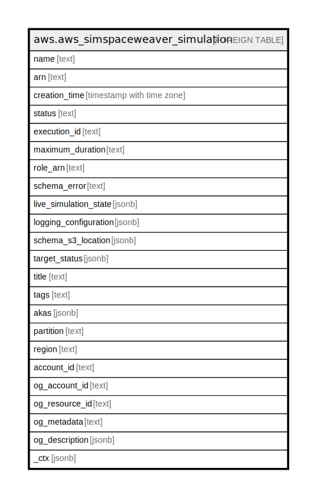

# aws.aws_simspaceweaver_simulation

## Description

AWS SimSpace Weaver Simulation

## Columns

| Name | Type | Default | Nullable | Children | Parents | Comment |
| ---- | ---- | ------- | -------- | -------- | ------- | ------- |
| name | text |  | true |  |  | The name of the simulation. |
| arn | text |  | true |  |  | The Amazon Resource Name (ARN) of the simulation. |
| creation_time | timestamp with time zone |  | true |  |  | The time when the simulation was created, expressed as the number of seconds and milliseconds in UTC since the Unix epoch (0:0:0.000, January 1, 1970). |
| status | text |  | true |  |  | The current status of the simulation. |
| execution_id | text |  | true |  |  | A universally unique identifier (UUID) for this simulation. |
| maximum_duration | text |  | true |  |  | The maximum running time of the simulation, specified as a number of months (m or M), hours (h or H), or days (d or D). |
| role_arn | text |  | true |  |  | The Amazon Resource Name (ARN) of the Identity and Access Management (IAM) role that the simulation assumes to perform actions. |
| schema_error | text |  | true |  |  | An error message that SimSpace Weaver returns only if there is a problem with the simulation schema. |
| live_simulation_state | jsonb |  | true |  |  | A collection of additional state information, such as domain and clock configuration. |
| logging_configuration | jsonb |  | true |  |  | Settings that control how SimSpace Weaver handles your simulation log data. |
| schema_s3_location | jsonb |  | true |  |  | The location of the simulation schema in Amazon Simple Storage Service (Amazon S3). |
| target_status | jsonb |  | true |  |  | The desired status of the simulation. |
| title | text |  | true |  |  | Title of the resource. |
| tags | text |  | true |  |  | A map of tags for the resource. |
| akas | jsonb |  | true |  |  | Array of globally unique identifier strings (also known as) for the resource. |
| partition | text |  | true |  |  | The AWS partition in which the resource is located (aws, aws-cn, or aws-us-gov). |
| region | text |  | true |  |  | The AWS Region in which the resource is located. |
| account_id | text |  | true |  |  | The AWS Account ID in which the resource is located. |
| og_account_id | text |  | true |  |  | The Platform Account ID in which the resource is located. |
| og_resource_id | text |  | true |  |  | The unique ID of the resource in opengovernance. |
| og_metadata | text |  | true |  |  | Platform Metadata of the AWS resource. |
| og_description | jsonb |  | true |  |  | The full model description of the resource |
| _ctx | jsonb |  | true |  |  | Steampipe context in JSON form, e.g. connection_name. |

## Relations

---

> Generated by [tbls](https://github.com/k1LoW/tbls)
