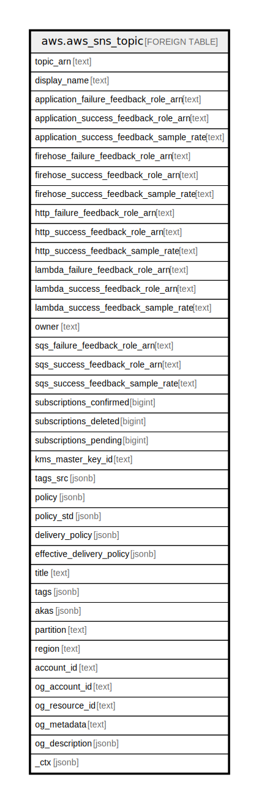

# aws.aws_sns_topic

## Description

AWS SNS Topic

## Columns

| Name | Type | Default | Nullable | Children | Parents | Comment |
| ---- | ---- | ------- | -------- | -------- | ------- | ------- |
| topic_arn | text |  | true |  |  | Amazon Resource Name (ARN) of the Topic. |
| display_name | text |  | true |  |  | The human-readable name used in the From field for notifications to email and email-json endpoints. |
| application_failure_feedback_role_arn | text |  | true |  |  | IAM role for failed deliveries of notification messages sent to topics with platform application endpoint. |
| application_success_feedback_role_arn | text |  | true |  |  | IAM role for successful deliveries of notification messages sent to topics with platform application endpoint. |
| application_success_feedback_sample_rate | text |  | true |  |  | Sample rate for successful deliveries of notification messages sent to topics with platform application endpoint. |
| firehose_failure_feedback_role_arn | text |  | true |  |  | IAM role for failed deliveries of notification messages sent to topics with kinesis data firehose endpoint. |
| firehose_success_feedback_role_arn | text |  | true |  |  | IAM role for successful deliveries of notification messages sent to topics with kinesis data firehose endpoint. |
| firehose_success_feedback_sample_rate | text |  | true |  |  | Sample rate for successful deliveries of notification messages sent to topics with firehose endpoint. |
| http_failure_feedback_role_arn | text |  | true |  |  | IAM role for failed deliveries of notification messages sent to topics with http endpoint. |
| http_success_feedback_role_arn | text |  | true |  |  | IAM role for successful deliveries of notification messages sent to topics with http endpoint. |
| http_success_feedback_sample_rate | text |  | true |  |  | Sample rate for successful deliveries of notification messages sent to topics with http endpoint. |
| lambda_failure_feedback_role_arn | text |  | true |  |  | IAM role for failed deliveries of notification messages sent to topics with lambda endpoint. |
| lambda_success_feedback_role_arn | text |  | true |  |  | IAM role for successful deliveries of notification messages sent to topics with lambda endpoint. |
| lambda_success_feedback_sample_rate | text |  | true |  |  | Sample rate for successful deliveries of notification messages sent to topics with lambda endpoint. |
| owner | text |  | true |  |  | The AWS account ID of the topic's owner. |
| sqs_failure_feedback_role_arn | text |  | true |  |  | IAM role for failed deliveries of notification messages sent to topics with sqs endpoint. |
| sqs_success_feedback_role_arn | text |  | true |  |  | IAM role for successful deliveries of notification messages sent to topics with sqs endpoint. |
| sqs_success_feedback_sample_rate | text |  | true |  |  | Sample rate for successful deliveries of notification messages sent to topics with sqs endpoint. |
| subscriptions_confirmed | bigint |  | true |  |  | The number of confirmed subscriptions for the topic. |
| subscriptions_deleted | bigint |  | true |  |  | The number of deleted subscriptions for the topic. |
| subscriptions_pending | bigint |  | true |  |  | The number of subscriptions pending confirmation for the topic. |
| kms_master_key_id | text |  | true |  |  | The ID of an AWS-managed customer master key (CMK) for Amazon SNS or a custom CMK. |
| tags_src | jsonb |  | true |  |  | The list of tags associated with the topic. |
| policy | jsonb |  | true |  |  | The topic's access control policy (i.e. Resource IAM Policy). |
| policy_std | jsonb |  | true |  |  | Contains the policy in a canonical form for easier searching. |
| delivery_policy | jsonb |  | true |  |  | The JSON object of the topic's delivery policy. |
| effective_delivery_policy | jsonb |  | true |  |  | The effective delivery policy, taking system defaults into account. |
| title | text |  | true |  |  | Title of the resource. |
| tags | jsonb |  | true |  |  | A map of tags for the resource. |
| akas | jsonb |  | true |  |  | Array of globally unique identifier strings (also known as) for the resource. |
| partition | text |  | true |  |  | The AWS partition in which the resource is located (aws, aws-cn, or aws-us-gov). |
| region | text |  | true |  |  | The AWS Region in which the resource is located. |
| account_id | text |  | true |  |  | The AWS Account ID in which the resource is located. |
| og_account_id | text |  | true |  |  | The Platform Account ID in which the resource is located. |
| og_resource_id | text |  | true |  |  | The unique ID of the resource in opengovernance. |
| og_metadata | text |  | true |  |  | Platform Metadata of the AWS resource. |
| og_description | jsonb |  | true |  |  | The full model description of the resource |
| _ctx | jsonb |  | true |  |  | Steampipe context in JSON form, e.g. connection_name. |

## Relations

---

> Generated by [tbls](https://github.com/k1LoW/tbls)
