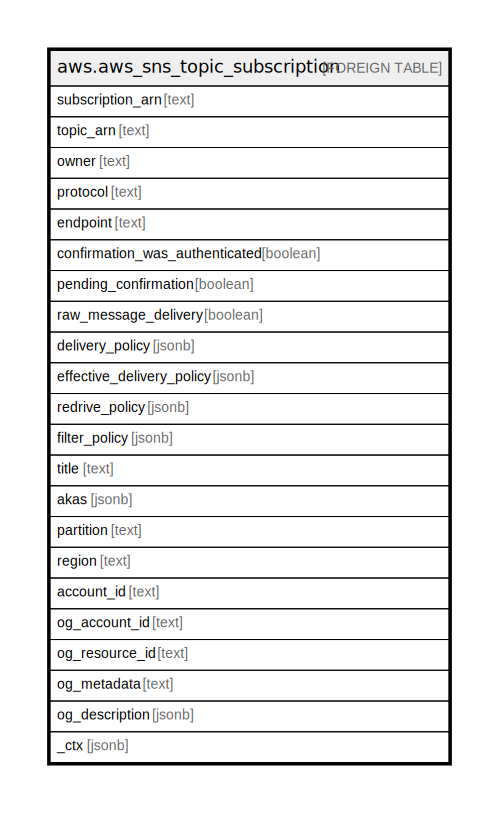

# aws.aws_sns_topic_subscription

## Description

AWS SNS Topic Subscription

## Columns

| Name | Type | Default | Nullable | Children | Parents | Comment |
| ---- | ---- | ------- | -------- | -------- | ------- | ------- |
| subscription_arn | text |  | true |  |  | Amazon Resource Name of the subscription. |
| topic_arn | text |  | true |  |  | The topic ARN that the subscription is associated with. |
| owner | text |  | true |  |  | The AWS account ID of the subscription's owner. |
| protocol | text |  | true |  |  | The subscription's protocol. |
| endpoint | text |  | true |  |  | The subscription's endpoint (format depends on the protocol). |
| confirmation_was_authenticated | boolean |  | true |  |  | Reflects authentication status of the subscription. |
| pending_confirmation | boolean |  | true |  |  | Reflects the confirmation status of the subscription. True if the subscription hasn't been confirmed. |
| raw_message_delivery | boolean |  | true |  |  | true if raw message delivery is enabled for the subscription. |
| delivery_policy | jsonb |  | true |  |  | The JSON of the subscription's delivery policy. |
| effective_delivery_policy | jsonb |  | true |  |  | The JSON of the effective delivery policy that takes into account the topic delivery policy and account system defaults. |
| redrive_policy | jsonb |  | true |  |  | When specified, sends undeliverable messages to the specified Amazon SQS dead-letter queue. Messages that can't be delivered due to client errors (for example, when the subscribed endpoint is unreachable) or server errors (for example, when the service that powers the subscribed endpoint becomes unavailable) are held in the dead-letter queue for further analysis or reprocessing. |
| filter_policy | jsonb |  | true |  |  | The filter policy JSON that is assigned to the subscription. |
| title | text |  | true |  |  | Title of the resource. |
| akas | jsonb |  | true |  |  | Array of globally unique identifier strings (also known as) for the resource. |
| partition | text |  | true |  |  | The AWS partition in which the resource is located (aws, aws-cn, or aws-us-gov). |
| region | text |  | true |  |  | The AWS Region in which the resource is located. |
| account_id | text |  | true |  |  | The AWS Account ID in which the resource is located. |
| og_account_id | text |  | true |  |  | The Platform Account ID in which the resource is located. |
| og_resource_id | text |  | true |  |  | The unique ID of the resource in opengovernance. |
| og_metadata | text |  | true |  |  | Platform Metadata of the AWS resource. |
| og_description | jsonb |  | true |  |  | The full model description of the resource |
| _ctx | jsonb |  | true |  |  | Steampipe context in JSON form, e.g. connection_name. |

## Relations

---

> Generated by [tbls](https://github.com/k1LoW/tbls)
